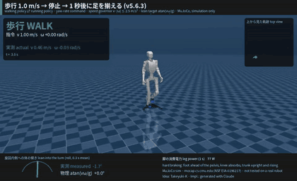
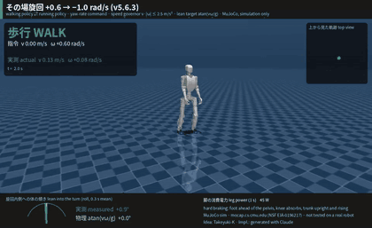
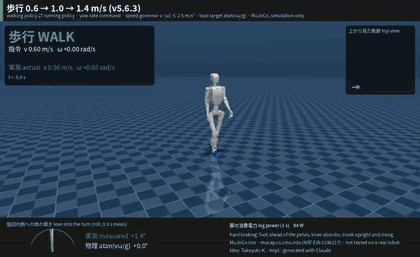
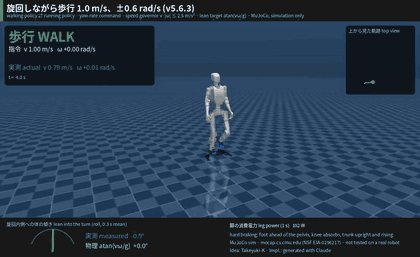
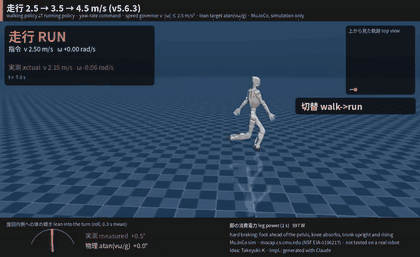
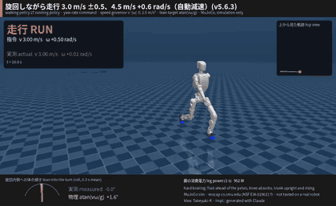
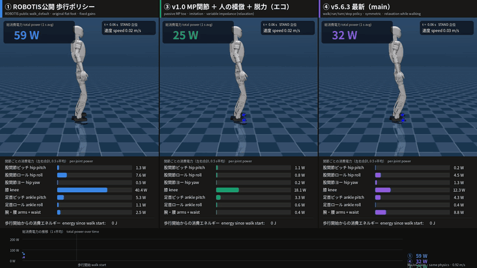

# K1 MP Eco-Walk

[English](README.md) | **日本語**

[](https://doi.org/10.5281/zenodo.23178357)

**受動バネのつま先（MP）関節を付けた ROBOTIS AI Sapiens K1 ヒューマノイドの、省エネな歩行・走行・旋回ポリシー
（現行版 v5.6.3）。MuJoCo シミュレーションのみ。**

発案・方針決め：**Takeyuki-K** ・ 実装：Takeyuki-K の指示のもと Claude（Anthropic）で生成

> **シミュレーションのみです。** このページの内容はすべて、MuJoCo 物理シミュレーター上で、K1 のモデルを改変したもの
> （受動バネのつま先関節を追加）で作成・測定しました。**実機では一切試験していません。** 消費電力は、定数を仮定した
> モーターモデルによる推定値です（[電力モデル](#電力モデル)）。個人の独立した研究で、**ROBOTIS 社とは関係がなく、
> 承認も受けていません。**
>
> **ライセンス：** プロジェクトのコードと独自アセットは **Apache-2.0**・人の歩行データ由来の参照軌道は **CC BY 4.0**
> （Marcos Duarte & Renato Naville Watanabe, BMC）・CMU モーションキャプチャは自由利用（下記の謝辞）。
> [NOTICE](NOTICE) と [THIRD_PARTY_LICENSES.md](THIRD_PARTY_LICENSES.md) を参照してください。

## 現行ポリシー（v5.6.3）でできること

歩行ポリシーと走行ポリシーを1つずつ持ち、ゲートマネージャーが自動で切り替えます。指令は前進速度 *v* と
旋回速度 *ω*（と「停止」「急停止」）だけです。動画はすべて MuJoCo、実時間、ロボット1台です。

| | |
|---|---|
| **停止して足を揃える。** 足を揃えずにすぐ止まり、指令がなければ1秒後に足踏みして最初の立ち姿勢へ戻ります。  | **その場旋回**（+0.6 → −1.0 rad/s）。人のモーションキャプチャから取った旋回リズムで、両足を上げて踏み替えます。  |
| **歩行** 0.6 → 1.0 → 1.4 m/s。受動つま先関節でかかとからつま先へ転がり、遊脚では関節を脱力します。  | **旋回しながら歩行** 1.0 m/s、±0.6 rad/s。  |
| **走行** 2.5 → 3.5 → 4.5 m/s。歩行 → 走行 → 歩行を自動で切り替えます。  | **旋回しながら走行**：3 m/s で ±0.5 rad/s、続いて 4.5 m/s で 0.6 rad/s。自動で減速し、体を旋回の内側へ傾けます。  |

高解像度の MP4：`media/K1_v563_{stop,inplace,walk,walk_turn,run,run_turn}.mp4`

| 能力（シミュレーション） | v5.6.3 |
|---|---|
| 歩行速度 | 0.3〜1.65 m/s（それ以上は走行へ切り替え） |
| 走行速度 | 4.5 m/s まで試験（モーターのトルク・速度特性のモデルの範囲内で、指令 5.5 m/s まで学習） |
| 旋回 | 歩行中・走行中・その場で、旋回速度 1 rad/s まで。自動減速 v·\|ω\| ≤ 1 m/s²（歩行）、≤ 2.5 m/s²（走行） |
| 走行旋回での体の傾き | 物理的な傾き atan(vω/g) の 80〜85 %、左右の旋回で対称 |
| 停止 | すぐ止まる（その場旋回から 1.7 秒、1.2 m/s 歩行から 3.3 秒、4.5 m/s 走行から 5.9 秒）。4.5 m/s からの急停止は 3.8 秒で立位。立って1秒後に足を揃え直す |
| 外乱への強さ | 通しコース（歩行・旋回・走行・自動減速しての旋回・急停止、54 秒）：64 台中 64 台が完走。ランダムな押し外乱（±0.3 m/s を約3秒ごと）ありで 62/64 |
| 左右対称性 | 歩行・走行とも、左右の鏡像対称性の制約を入れて学習 |
| 立っているとき | 関節が脱力しない（硬さの下限あり）、足が滑らない |

## 消費電力：v1.0 の比較を同じ方法で測り直し

このプロジェクトは、**歩行の消費電力を減らす**取り組みとして始まりました（受動つま先関節 × 人の歩行の模倣 ×
学習による脱力）。最初の成果（v1.0）は、ROBOTIS 公開の `walk_default` ポリシーと同じシミュレーション条件で比較して
測りました。現行ポリシーでも同じ測定を行いました（`k1_compare/compare3.py`、同じスクリプト・同じ物理条件・同じ
電力モデル、約 0.9 m/s の直進歩行）。



| 制御（直進歩行、約 0.9 m/s） | 速度 | 消費電力（全体） | うち脚 | 移動コスト CoT（電気） | ① との比較 |
|---|---|---|---|---|---|
| ① ROBOTIS 公開 `walk_default`（元の平らな足） | 0.901 m/s | 179.1 W | 172.4 W | 0.568 | – |
| ③ v1.0：MP 関節 ＋ 模倣 ＋ 脱力（直進歩行のみ） | 0.917 m/s | 114.1 W | 111.9 W | 0.355 | −37 % |
| ④ **v5.6.3**（現行。歩行・走行・旋回システムの歩行ポリシー） | 0.888 m/s | 125.5 W | 119.1 W | 0.403 | **−29 %** |

v5.6.3 から使っている厳密な静止摩擦（`COMPARE_NOSLIP=10`）で同じ比較をすると、① 177.8 W（CoT 0.560）、
v1.0 117.8 W（0.355、−37 %）、v5.6.3 126.3 W（0.408、−27 %）です。

- この比較は、プロジェクトのうち**歩行の消費電力削減**の取り組みの一部で、定常の直進歩行の電力だけを比べています。
  制御全体の優劣を比べたものではありません。ROBOTIS のポリシーは別の目的で作られていて、電力は学習の目標ではありません。
- v5.6.3 は v1.0 より約 10 % 多く電力を使います。v1.0 は直進歩行しかできませんでしたが、v5.6.3 は旋回・走行・停止・
  押し外乱からの立て直しができ、骨盤をほぼ水平に保ち、左右対称に動きます。それでもこのシミュレーションでは、
  ① より移動コストが **27〜29 % 低い**です。
- 動画：`media/K1_v1_v563_energy_comparison.mp4`（関節ごとの電力をリアルタイム表示。v1.0 の動画と同じく3つとも 0.92 m/s の
  指令で記録。最後の集計画面の % は消費電力の比）、数値：`k1_compare/results/res_*.json`

## 仕組み（概要）
1. **受動バネのつま先（MP）関節**を K1 に追加。モーターなしで足がつま先へ転がります。
2. **人の歩行の模倣**。人の歩行データ（BMC）と CMU の走行キャプチャから作った参照動作。
3. **学習による脱力**。ポリシーは 20 ms ごとに関節の硬さと粘りも選び、消費電力が低いほど報酬が増えます。歩行中・
   走行中は一瞬完全に脱力してもよく（慣性を使った体の運び）、立っているときは脱力しません。
4. **ゲートマネージャー**。歩行⇄走行の切り替え、旋回時の自動減速、旋回時の体の傾き、急停止、すぐ止まる停止と
   その後の足揃え（足の位置は関節角からの順運動学・逆運動学、両足接地は足裏接触センサーで判定）。
5. 歩行・走行とも**左右の鏡像対称性**。参照動作も左右対称に作り直しています。
6. シミュレーターの**静止摩擦を厳密化**（no-slip）。足は実際に踏み替えたときしか動きません。

v1 から v5.6.3 までの開発の経緯、判断とその理由、不採用にした段階、過去の結果はすべて
**[history/README.ja.md](history/README.ja.md)** と各フォルダーのレポートにあります（最新：
[k1_mp_gait56/REPORT_GAIT56.md](k1_mp_gait56/REPORT_GAIT56.md)、学習コマンド：
[k1_mp_gait56/TRAINING_HISTORY.md](k1_mp_gait56/TRAINING_HISTORY.md)）。

## 制約
- **シミュレーションのみ**で、sim2real の作業はしていません。モーター定数、トルク上限、トルク・速度特性はモデル化・
  仮定した値です。
- 足揃えは、実機では足裏接触センサーが必要です（シミュレーションでは、かかと・母指球・つま先の接触センサーを使用）。
- その場旋回の後に止まると、足揃え後も前後に 6〜8 cm ずれが残ることがあります。
- 一番きつい走行旋回は v·|ω| ≤ 2.5 m/s² に制限しています（3.0 では走行ポリシーが傾きすぎて転倒しました）。
- 0.6〜1.0 m/s の歩行は v1.0／v5.5 より数 % 多く電力を使います。その場旋回は実際に足を上げて踏み替えるため
  約 100〜120 W かかります（以前のポリシーは片足を床の上で回していました）。

## 電力モデル
2 ms の物理ステップごとに、各関節で：`τ = clip(Kp(q* − q) − Kd·q̇, モーター上限)`

`P = Σ τ²/Km² + Σ max(τ·q̇, 0)` — 銅損（ジュール損）＋ 正の機械仕事、回生なし。
Km = 4.0 Nm/√W（股関節・膝・足首ピッチ・腰）、2.2 Nm/√W（足首ロール・腕）は**仮定値**です。
CoT = P / (m g v)、m = 35.7 kg。

## 評価・再現
```bash
pip install -r requirements.txt            # 環境の詳細は history/README.ja.md の「再現」
bash scripts/fetch_external.sh             # 固定したコミットの外部データ（BMC 歩行データ、ROBOTIS ai_sapiens）
cd k1_mp_gait56
python3 eval_gait56.py runs/final/walk.pt runs/final/run.pt [--push --n 16]   # 通しコース
python3 eval_power56.py runs/final/walk.pt runs/final/run.pt                  # 歩行・旋回・走行の電力
python3 eval_inplace56.py runs/final/walk.pt runs/final/run.pt                # その場旋回
python3 eval_runturn56.py runs/final/walk.pt runs/final/run.pt                # 走行旋回での体の傾き
MUJOCO_GL=osmesa python3 video_gait56.py runs/final/walk.pt runs/final/run.pt v_run_turn out.mp4
cd ../k1_compare && python3 compare3.py robotis && python3 compare3.py eco && python3 compare3.py v563
```
ポリシー：`k1_mp_gait56/runs/final/walk.pt`、`k1_mp_gait56/runs/final/run.pt`

## リポジトリ構成（主な部分）
| パス | 内容 |
|---|---|
| `k1_mp_gait56/` | **現行版**（v5.6〜v5.6.3）：環境、学習、ゲートマネージャー `gait56.py`、評価、レポート |
| `k1_compare/` | ROBOTIS 公開ポリシーとの同一条件での電力比較 |
| `ai_sapiens/` | K1 モデル（ROBOTIS、Apache-2.0）と MP 関節付き K1 |
| `k1_mp*/` | 以前の段階（v1〜v5.5）。[history/README.ja.md](history/README.ja.md) を参照 |
| `history/` | 開発履歴の README（英語・日本語） |
| `media/` | 動画と GIF |

## 著作・役割
**発案・方針決め — Takeyuki-K**（コンセプト：受動バネの MP つま先関節 × 人の歩行の模倣 × アクチュエーターの脱力による
省エネなヒューマノイド。仕様と評価基準の全一覧は [history/README.ja.md](history/README.ja.md) を参照）。
**実装 — Claude（Anthropic）で生成**。Takeyuki-K の指示・選択・試験・統合のもとで作成しました。これは作り方の説明で
あり、AI 生成物の著作権の帰属（国・地域によって異なる）についての表明ではありません。

## このアイデアの利用
この成果は自由に利用・改変・発展させてかまいません（コード：Apache-2.0。データファイルはそれぞれのライセンスに従います。
[THIRD_PARTY_LICENSES.md](THIRD_PARTY_LICENSES.md) を参照）。
**この成果やアイデアから着想を得た場合は、`Takeyuki-K` のクレジットとこのリポジトリへのリンクをお願いします**
（GitHub の "Cite this repository" は [CITATION.cff](CITATION.cff) を使います）。
Zenodo にアーカイブ済み：**DOI [10.5281/zenodo.23178357](https://doi.org/10.5281/zenodo.23178357)** — この DOI で引用してください。

**特許は取らず、誰にでも開放します。** 誰もが使い、問題を見つけ、改良できるように公開しています。日付付きの公開
（Zenodo DOI）は防衛的公開も兼ねています。再配布の際は [NOTICE](NOTICE) ファイルを残してください（Apache-2.0 §4(d)）。

## 謝辞・クレジット
- **ロボットモデル**：ROBOTIS AI Sapiens K1、[ROBOTIS-GIT/ai_sapiens](https://github.com/ROBOTIS-GIT/ai_sapiens)（Apache-2.0）、コミット `bdc40f1` — 改変あり（受動バネの MP つま先関節を追加）。[ai_sapiens/NOTICE_MODIFICATIONS.md](ai_sapiens/NOTICE_MODIFICATIONS.md) を参照。
- **人の歩行データ**：Marcos Duarte and Renato Naville Watanabe, "Notes on Scientific Computing for Biomechanics and Motor Control"（BMC）、[BMClab/BMC](https://github.com/BMClab/BMC)、DOI [10.5281/zenodo.4599319](https://doi.org/10.5281/zenodo.4599319)、コミット `50a05ae`、[CC BY 4.0](https://creativecommons.org/licenses/by/4.0/) — ロボットへリターゲット。派生した参照ファイルも CC BY 4.0（一覧は [NOTICE](NOTICE)）。
- **走行のモーションデータ**：CMU Graphics Lab Motion Capture Database、[mocap.cs.cmu.edu](http://mocap.cs.cmu.edu)（subject 16 trial 35、subject 9 trial 4）、B. Hahne による BVH 変換 — 研究・商用とも自由利用。*The data used in this project was obtained from mocap.cs.cmu.edu. The database was created with funding from NSF EIA-0196217.*
- **その場旋回のリズム**：作者が提供した動画（単眼の姿勢推定）から抽出。含めているのは抽出したリズム
  （`k1_mp_gait56/mocap/turn_rhythm.json`）のみで、録画そのものは含めていません。
- **使用ソフトウェア**（再配布なし）：[THIRD_PARTY_LICENSES.md](THIRD_PARTY_LICENSES.md) を参照。

"ROBOTIS" および "AI Sapiens" はそれぞれの所有者の商標である可能性があります。ここではロボットモデルの識別のためだけに使用しています。
