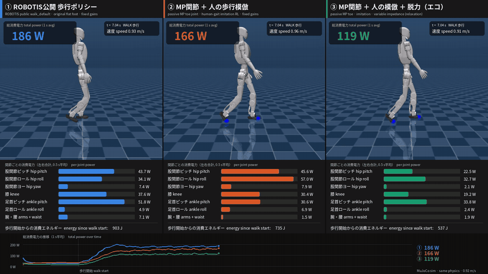
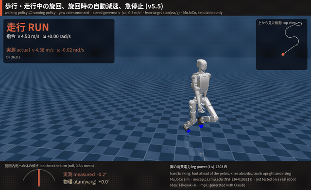
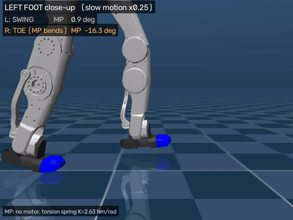
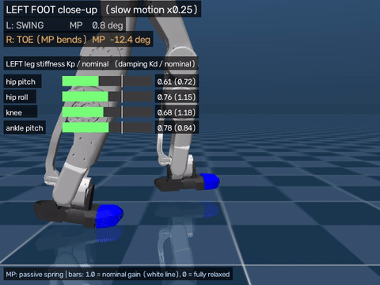
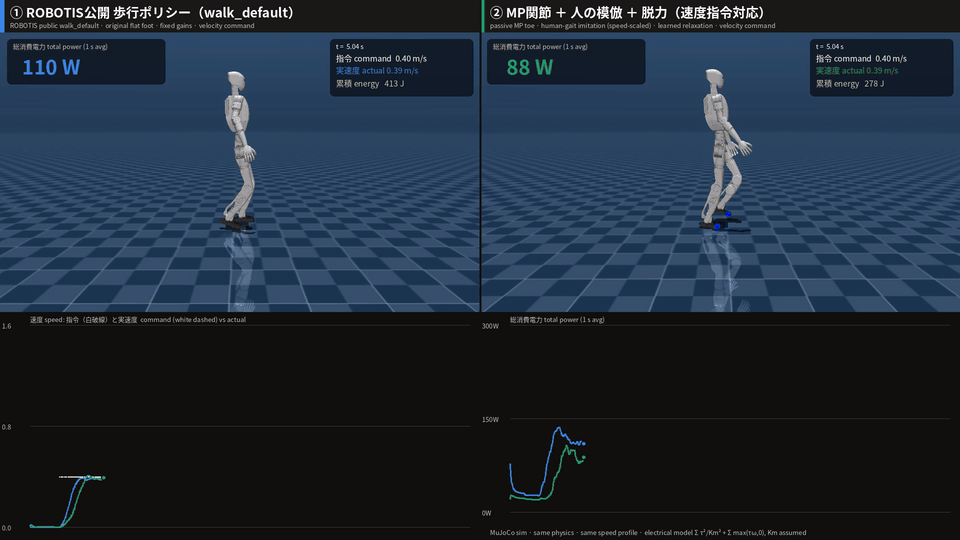
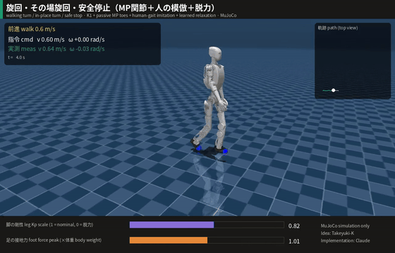
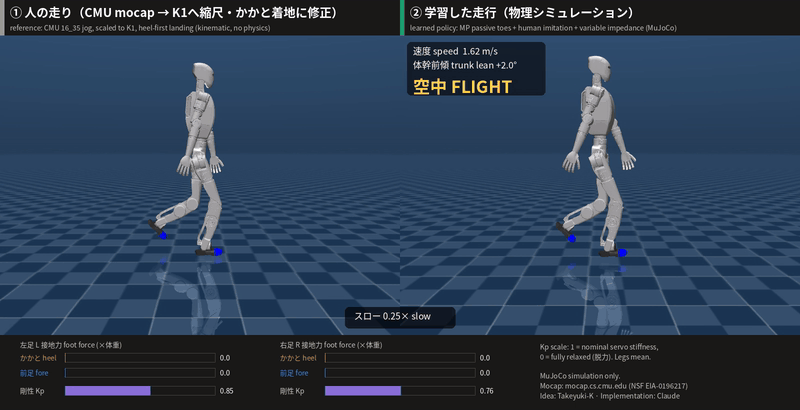
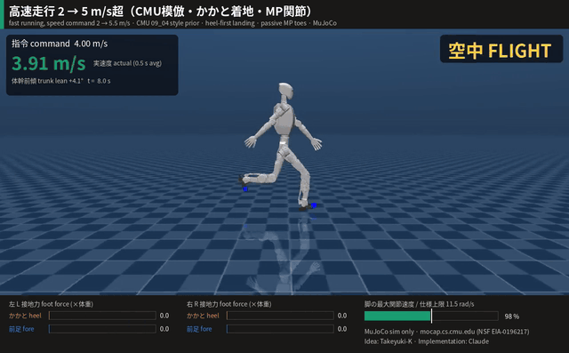
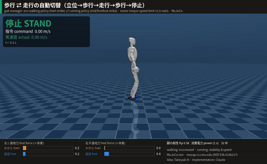

# K1 MP Eco-Walk

**English** | [日本語](README.ja.md)

[](https://doi.org/10.5281/zenodo.23178357)

**Passive spring toe (MP) joints × human-gait imitation × learned relaxation → energy-efficient humanoid walking (MuJoCo simulation)**


Idea & direction: **Takeyuki-K** · Implementation generated with Claude (Anthropic) under Takeyuki-K's direction · Simulation only

> **Licences:** project code and original assets **Apache-2.0** · human-gait-derived reference trajectories
> **CC BY 4.0** (Marcos Duarte & Renato Naville Watanabe, BMC) · CMU motion-capture files: free use, acknowledgement
> below. See [NOTICE](NOTICE) and [THIRD_PARTY_LICENSES.md](THIRD_PARTY_LICENSES.md).



> **Simulation only (MuJoCo).** Independent personal research, **not affiliated with or endorsed by ROBOTIS.**

**Latest (v5):** automatic walk ⇄ run switching, stand → run and forefoot running up to 4.9 m/s with the motor drive
torque kept inside a modelled K1 torque–speed envelope (joints can still be back-driven above the speed limit by impacts) — see
[Road to running](#road-to-running) and [v5](#walk--run-switching-forefoot-running-within-a-modelled-motor-drive-envelope) (simulation only, not tested on a real robot).

**v5.5 (branch `v5.5-turn-run`, under review):** turning while walking *and running* (yaw-rate command up to 1 rad/s),
in-place turning, an automatic speed governor (v·|ω| ≤ 3 m/s² while running) with the body leaning into the turn
(measured lean ≈ atan(vω/g)), and hard braking (4.5 m/s → standing in 4.4 s / 6.2 m instead of 5.9 s / 8.7 m) —
see [k1_mp_gait55/REPORT_GAIT55.md](k1_mp_gait55/REPORT_GAIT55.md). Simulation only.



Videos: [`media/K1_v55_turn_run.mp4`](media/K1_v55_turn_run.mp4) (full profile) ·
[`media/K1_v55_brake.mp4`](media/K1_v55_brake.mp4) (hard braking, side view) ·
[`media/K1_v55_inplace.mp4`](media/K1_v55_inplace.mp4) (in-place turning).

---

## Idea

Instead of making a humanoid walk with stiff, always-on motors, let **natural physics** do part of the work:

1. **Passive MP (toe) joint** – a motor-less torsion spring that bends when the body weight rolls onto the toes and returns the toe flat in swing. The spring is sized so that it can never lift the foot by itself.
2. **Imitation of human walking data** – only the hip→ankle vector is imitated (scaled by the leg-length ratio), the rest is solved by IK, so the robot learns a human heel-strike → foot-flat → toe-off rollover.
3. **Learned relaxation** – the policy chooses joint stiffness Kp and damping Kd every 20 ms (the K1 motors' "MIT mode"), and is rewarded for low electrical power. It learned by itself to relax the hip and knee at push-off / swing (pendulum-like swing, passive knee flexion) and to stiffen the ankle for push-off.


## Result

Three controllers on the same K1 model family, same MuJoCo physics (dt 2 ms, 50 Hz control), same start, straight
walking, **approximately speed-matched (0.90–0.93 m/s)**, same electrical power model. Values are **simulation estimates**
taken from [`k1_compare/results/comparison_table.csv`](k1_compare/results/comparison_table.csv).

| | controller | speed | estimated electrical power (total) | of which legs | CoT (electrical) | CoT vs ① |
|---|---|---|---|---|---|---|
| ① | ROBOTIS public `walk_default` policy, original flat foot | 0.901 m/s | 179.1 W | 172.4 W | 0.568 | – |
| ② | MP joint + human-gait imitation, fixed gains | 0.927 m/s | 156.6 W | 154.5 W | 0.482 | −15 % |
| ③ | **MP joint + imitation + learned relaxation** | 0.917 m/s | **114.1 W** | **111.9 W** | **0.355** | **−37 %** |

i.e. **37 % lower estimated electrical cost of transport under this simulation condition** (total power −36 %).
The live numbers drawn in the comparison video come from the video recording (which includes the start from standing)
and therefore differ from this steady-state table.

| ② heel strike → flat → toe-off, passive MP bending (slow ×0.25) | ③ learned stiffness within one stride (slow ×0.25) |
|---|---|
|  |  |

Full videos (MP4): [`media/K1_3way_energy_comparison.mp4`](media/K1_3way_energy_comparison.mp4) (3-up comparison with live per-joint power),
[`media/K1_MP_heel_toe_walk.mp4`](media/K1_MP_heel_toe_walk.mp4) (②, heel-to-toe close-up),
[`media/K1_MP_eco_walk.mp4`](media/K1_MP_eco_walk.mp4) (③, live stiffness bars).

Other findings (simulation):
- ③ keeps the heel-strike → flat → toe-off sequence (17/18 heel-first touchdowns); MP bends up to ~55° at push-off.
- Robustness improved with relaxation: standing with random pushes 73 % → 88 % survival, stand→walk→stop with domain randomisation + pushes 86 % → 98 % (② vs ③, 64 envs, 8 s; `k1_mp_eco/out/eco_results.json`).
- The ranking ① > ② > ③ also holds for the legs' positive mechanical work (independent of the assumed motor constant): 53.0 W > 48.7 W > 44.2 W.

### Honest limitations
- **① is a general-purpose policy** (omnidirectional velocity tracking, made for the real robot). ②③ are specialised for straight walking at one speed. The −37 % is valid for this condition only.
- ②③ have no heading control yet (lateral drift 0.8–1.8 m over 10 m).
- The electrical model uses an **assumed** motor constant Km (4.0 / 2.2 Nm/√W); gearbox friction, driver losses and electronics are not modelled. Compare the numbers relatively, not with other robots.
- No real-robot experiment yet. MP spring, toe mass and contact parameters are estimates.

## Speed command

One policy now follows a changing forward speed command **0.30 – 1.35 m/s** while keeping the MP toes, the human-gait
imitation and the learned relaxation. Slower = shorter steps and lower cadence, faster = longer steps and higher cadence
(human walk-ratio law). Details and every design decision: [k1_mp_speed/REPORT_SPEED.md](k1_mp_speed/REPORT_SPEED.md).



| command | 0.30 | 0.45 | 0.60 | 0.75 | 0.90 | 1.00 | 1.20 | 1.35 m/s |
|---|---|---|---|---|---|---|---|---|
| measured speed | 0.31 | 0.45 | 0.61 | 0.76 | 0.91 | 1.02 | 1.19 | 1.30 |
| step length (m) | 0.24 | 0.29 | 0.34 | 0.39 | 0.43 | 0.46 | 0.50 | 0.55 |
| estimated leg power vs ROBOTIS walk_default | −8 % | −32 % | −33 % | −36 % | −37 % | −36 % | −36 % | −38 % |

No falls, heel contact at every touchdown, heading drift ≤ 4.3°, 87.5 % survival with random commands + pushes + domain
randomisation. Above the training range the robot saturates at ~1.45 m/s (step length ≈ 0.55 m) without falling — faster
needs a running gait (future work). Full video: [`media/K1_speed_command_comparison.mp4`](media/K1_speed_command_comparison.mp4).

## Turning & safe stop

The speed-command walker now also follows a **yaw-rate command**: walking turns, **in-place turns** and a **safe stop**
(decelerate first, then bring the feet together). Details and every design decision:
[k1_mp_turn/REPORT_TURN.md](k1_mp_turn/REPORT_TURN.md).



| test (8 robots, from standing) | result |
|---|---|
| walking turn 0.6 m/s, ±0.5 rad/s / 1.0 m/s, 1.0 rad/s | 100 % survival, yaw-rate error ≤ 0.3 % |
| in-place turn ±0.3 / ±0.6 / 0.8 rad/s | 100 % survival, drift ≤ 2.8 cm/s |
| in-place turn 1.0 rad/s | 87.5 % (limit) |
| stop command from 1.2 m/s / from a walking turn / from an in-place turn | 8/8 standing after 3.3 / 2.3 / 1.7 s |
| straight walking 0.3–1.35 m/s (regression) | no falls, speed error ≤ 7.5 %, but **+16–27 % power at 0.9–1.35 m/s vs v2** |

Full video: [`media/K1_turning.mp4`](media/K1_turning.mp4).

## Road to running

Running was developed in three steps; each step answers a problem found in the previous one. The final result is v5.
All numbers are **MuJoCo simulation estimates; nothing has been tested on a real K1**.

| step | what was tried | what was found | what it led to |
|---|---|---|---|
| **v3** jog | imitate a CMU jog, heel-first landing, stability over power | jogging at 1.54 m/s costs 342 W (CoT 0.64); **walking at about the same speed is much cheaper** (v4 fast walk at 1.63 m/s: 216 W, CoT 0.38, ≈ 40 % less) | walk as long as walking can go (up to ~1.6 m/s), run only above that |
| **v4** fast walk + fast run | fast walking 1.35–1.65 m/s (energy reward kept); running up to 5.2 m/s, heel-first landing kept | 5.2 m/s only by running the leg joints **above the K1 URDF speed limit (11.5 rad/s) 28 % of the time** → possibly beyond the motor specification; with the limit as a penalty: 4.6 m/s | model the motor torque–speed limit physically; reconsider the heel landing |
| **v5** walk ⇄ run | fore/midfoot landing, physical motor model, stand → run, automatic walk ⇄ run switching | 4.9 m/s with the motor drive torque inside the modelled torque–speed envelope, 0 % heel-first landings, 100 % switching success without pushes | current state (see the v5 section) |

**Why the forefoot (idea: Takeyuki-K).** When running fast, humans tend to land on the fore/midfoot with the foot closer
under the body; a heel landing far in front of the body is expected to act more like a brake on the forward momentum.
v5 therefore lands like the human runner in the CMU data instead of the heel landing used in v3/v4.
Note: this braking effect is the motivating hypothesis and was **not measured directly** in this project (no braking-impulse
analysis); also, many recreational runners do land heel first, while fore/midfoot landing is typical at higher speeds.
What was measured is the outcome: a higher top speed with the motor drive torque inside the modelled envelope and a similar or slightly lower estimated
cost of transport at the same command (v5 table below).

## Running (jog)

Running imitated from **CMU motion-capture data** (subject 16, "run/jog"), with the landing changed to **heel first**
as requested; stability and impact absorption weighted over power. Details: [k1_mp_run/REPORT_RUN.md](k1_mp_run/REPORT_RUN.md).
**Finding:** at this speed walking is cheaper than running (jog 342 W, CoT 0.64 at 1.54 m/s vs fast walk 216 W, CoT 0.38 at
1.63 m/s), which led to the fast-walking range of v4 and the walk ⇄ run switching of v5.



| | learned running |
|---|---|
| speed / cadence | 1.54 m/s, 174 steps/min |
| flight phase | 29 % of the time (human reference 35 %) |
| touchdown | heel only, 100 % |
| peak foot force | 2.3 body weights (human running ≈ 2.5) |
| trunk | 1.8° forward lean, ±0.36° |
| robustness | 100 % survival with pushes (±0.6 m/s) + friction/mass randomisation (24 robots, 16 s) |
| relaxation | only in swing (Kp ≈ 0.6 of nominal), stiff again before touchdown |

Full video: [`media/K1_running.mp4`](media/K1_running.mp4).
Mocap: *The data used in this project was obtained from mocap.cs.cmu.edu. The database was created with funding from NSF EIA-0196217.*

## Fast walking & fast running

**Fast walking** (`k1_mp_fastwalk/`): 1.35–1.65 m/s is covered by walking with longer steps (energy reward kept);
**fast running** (`k1_mp_sprint/`): CMU running as a style prior, automatic speed curriculum to **5 m/s**, stability
and speed first, power only measured. Details: [REPORT_FASTWALK.md](k1_mp_fastwalk/REPORT_FASTWALK.md),
[REPORT_SPRINT.md](k1_mp_sprint/REPORT_SPRINT.md).



| | result |
|---|---|
| fast walk at 1.63 m/s | 216 W, CoT 0.38 (jog at 1.54 m/s: 342 W → walking ≈ 40 % less) |
| fast running, top speed | **5.21 m/s**, 100 % survival (24 robots; also with pushes + randomisation) |
| fast running gait at top speed | 239 steps/min, step 1.31 m, 45 % flight, heel-first 99 %, trunk +4.5° ± 1.0° |
| **motor-speed limit (URDF 11.5 rad/s)** | exceeded 28 % of the time at 5.2 m/s; a limit-respecting policy reaches **4.6 m/s** |

**Finding:** the 5.2 m/s run is only possible by driving the leg joints above the K1 URDF speed limit, i.e. probably
beyond what the real motors can do; in v4 the motors are not modelled (no torque–speed curve) and the landing is still
heel first. Both points led to v5.

Full video: [`media/K1_sprint.mp4`](media/K1_sprint.mp4).

## Walk ⇄ run switching, forefoot running within a modelled motor drive envelope

> **Simulation only — not tested on a real robot.** The motor limits below are a *model* of the K1 URDF values with an
> assumed torque–speed curve; whether a real K1 can run like this has not been tested.

Running now lands **forefoot first (84–99 % of touchdowns, the rest midfoot; 0 % heel-first)**, the leg motors follow a
**model of the K1 URDF torque–speed limits** (96.9 Nm, 11.5 rad/s, assumed curve with back-EMF braking), the robot can
start running **from standing**, and a gait manager switches **walk → run** when the command exceeds 1.8 m/s
(reference jumps 1.6 → 2.0 m/s) and **run → walk** when slowing down. Details: [REPORT_GAIT.md](k1_mp_gait/REPORT_GAIT.md).



| | result (MuJoCo) |
|---|---|
| stand → walk 0.3→1.65 (+0.15 m/s) → run → 5.5 cmd → walk → stop | 100 % (8 robots), 93.8 % with random pushes (32 robots) |
| stand → run 3 m/s directly → 4.5 → walk → stop | 100 %, 93.8 % with pushes |
| top running speed, motor drive torque inside the modelled torque–speed envelope | **4.9 m/s** (v4 heel strike, speed limit as penalty: 4.6 m/s) — joints are still back-driven above the speed limit by impacts (table below) |
| touchdowns while running | 84–99 % forefoot first, rest midfoot, **0 % heel first** |
| at the switching speed | walking 219 W (1.6 m/s, CoT 0.39) vs running 650 W (1.9 m/s, CoT 0.99) |

**Energy (estimated, simulation).** v5 did not add a further power reduction to walking (the walking policy has the same
power as v4; the 37 % lower estimated electrical CoT of v1 (with the speed-range results of v2) remains the energy result of this project), and the running policy has **no energy
reward**. Compared with the v4 policy that respects the joint-speed limit (heel first), running cost is similar at 3 m/s
and slightly lower at the higher commands, while v5 runs faster:

| command | v4 (heel first, speed limit as penalty) | v5 (forefoot, motor model) |
|---|---|---|
| 3.0 m/s | 2.93 m/s, CoT 0.93 | 2.97 m/s, CoT 0.95 |
| 4.0 m/s | 3.79 m/s, CoT 0.97 | 3.94 m/s, CoT 0.96 |
| 5.0 m/s | 4.43 m/s, CoT 1.04 | 4.67 m/s, CoT 1.03 |
| 5.5 m/s | 4.60 m/s, CoT 1.11 | 4.92 m/s, CoT 1.07 |

Sources: `k1_mp_sprint/out/final_eval_motorlimit.json` (start running at 2 m/s) and `k1_mp_gait/out/ew_rn6.json` (start from
fast walking); the start conditions differ, so this is not a controlled comparison. The main energy contribution of v5
is the **switching rule**: walking is used up to ~1.6 m/s because running at about the same speed costs ~3× more.

**Motor speed: what the model guarantees and what it does not.** The motor model never *drives* a joint beyond its speed
limit: in every sample where a joint was above the limit, the motor torque was braking against the motion (0 % motoring,
`k1_mp_gait/out/joint_speed_audit.json`, `audit_joint_speed.py`). The joints are, however, **pushed above the limit by
landing impacts and swing inertia**:

| command | speed | time with any leg joint above its limit | knee p99 / peak | ankle pitch p99 / peak | ankle roll (limit 20.9) p99 / peak |
|---|---|---|---|---|---|
| 2.0 | 1.87 m/s | 0.0 % | 11.3 / 11.5 rad/s | 10.0 / 10.8 | 9.5 / 13.0 |
| 3.0 | 2.97 | 1.3 % | 11.4 / 11.7 | 11.7 / 12.1 | 15.9 / 22.1 |
| 4.0 | 3.94 | 6.2 % | 11.9 / 12.3 | 11.9 / 14.3 | 19.4 / 25.6 |
| 5.0 | 4.67 | 16.0 % | 12.4 / 12.9 | 12.2 / 17.5 | 20.1 / 33.9 |
| 5.5 | 4.92 | 19.1 % | 12.6 / 13.3 | 12.4 / 17.8 | 21.2 / 40.6 |

The excess is usually small (median 0.4–0.6 rad/s), but short peaks reach 1.5× (ankle pitch) and 1.9× (ankle roll) the
limit at top speed. Whether the real gearboxes, motors and drivers tolerate this back-driving (and the regenerated
energy) is **unknown and untested**; for a real robot, 3 m/s or below is the range closest to the specification.

Videos: [`media/K1_walk_to_run.mp4`](media/K1_walk_to_run.mp4), [`media/K1_stand_to_run.mp4`](media/K1_stand_to_run.mp4).

## Power model
At every 2 ms physics step for every joint: `τ = clip(Kp(q* − q) − Kd·q̇, motor limit)`

`P = Σ τ²/Km² + Σ max(τ·q̇, 0)` — copper (Joule) loss + positive mechanical work, no regeneration.
CoT = P / (m g v). The Joule + mechanical decomposition follows the common practice in legged-robot energetics (e.g. Seok et al., MIT Cheetah, IEEE/ASME T-Mech 2015).

## Repository layout
| path | content |
|---|---|
| `ai_sapiens/ai_sapiens_description/` | K1 model (ROBOTIS, Apache-2.0) + **K1 with MP joints** (`k1_mp.xml`, `k1_mp.urdf`, split foot meshes) |
| `k1_mp/` | MP joint generator, human-gait retargeting, imitation (stage 1) + RL (stage 2), policy `runs/final/model.pt`, ONNX in `deploy/` |
| `k1_mp_eco/` | variable-impedance env & PPO, eco policy `runs/eco1/model.pt`, energy analysis, ONNX + gain law in `deploy_eco/` (see [README_ECO.md](k1_mp_eco/README_ECO.md)) |
| `k1_mp_speed/` | **v2 speed command**: speed-scaled human-gait library, env, PPO, evaluation, report, policy `runs/final/model.pt`, ONNX in `deploy_speed/` |
| `k1_mp_turn/` | **v3 turning**: yaw-rate command, walking / in-place turning, safe stop; policy `runs/final/model.pt`, report |
| `k1_mp_run/` | **v3 running**: CMU mocap (BVH) retargeting with heel-first landing, running env with assist curriculum, policy `runs/final/model.pt`, report |
| `k1_mp_fastwalk/` | **v4 fast walking** to 1.65 m/s (walking library to 1.95 m/s), policy `runs/final/model.pt` |
| `k1_mp_sprint/` | **v4 fast running**: CMU 09_04 speed library 1.6–5.5 m/s, speed curriculum, policies `runs/final/model.pt` (speed priority) and `model_motorlimit.pt` |
| `k1_mp_gait/` | **v5**: forefoot running with motor torque–speed model, stand → run, walk ⇄ run gait manager (`gait.py`), policies `runs/final/walk.pt`, `runs/final/run.pt` |
| `k1_mp_gait55/` | **v5.5**: turning while walking and running, in-place turning, speed governor, lean into the turn, hard braking; gait manager `gait55.py`, policies `runs/final/walk.pt`, `runs/final/run.pt`, report `REPORT_GAIT55.md` |
| `k1_compare/` | 3-way comparison: recording, power evaluation, figures, video composition; results in `results/` |
| `media/` | videos and GIFs |
| `scripts/` | `fetch_external.sh` (pinned upstream sources), `smoke_test.sh` |
| `LICENSES/`, `NOTICE`, `THIRD_PARTY_LICENSES.md` | licence texts and attribution |

## Reproduce

What can be reproduced, and how exactly:

| | status |
|---|---|
| **Evaluation of every released policy** (checkpoints in `*/runs/final/`, `k1_mp_eco/runs/eco1/`) | reproducible with the included code and the pinned upstream sources (section A) — e.g. re-running the 3-way comparison reproduced `k1_compare/results/comparison_table.csv` digit for digit |
| Generated model files and reference motions | regenerated **byte-identically** by the included scripts (checked by `scripts/smoke_test.sh`, checksums in `scripts/generated_files.sha256`) |
| Training of the fixed MP and eco policies (v1), fast walking (v4) | the documented commands use the released code as it was used |
| Training of the speed (v2), turning / jog (v3), sprint (v4) and walk ⇄ run (v5) policies | produced by an **iterative research process**: reward / environment settings were changed in the code between stages. The exact historical commands, the checkpoint carried over at each stage and the code differences are documented in each folder's `TRAINING_HISTORY.md`; stage-final checkpoints of v2 are included (`k1_mp_speed/runs/stages/`), those of v3–v5 are provided as GitHub release assets (`k1-mp-ecowalk_intermediate_checkpoints_*.zip`). Stages run with code that no longer exists cannot be replayed identically. For v2 an end-to-end re-training with the released code only was run: it reached the same quality (no falls, speed within 3.1 %, leg power within −18 … 0 % of the released policy; `k1_mp_speed/REPORT_SPEED.md` §7) |

### 0. Environment
Tested on Ubuntu 24.04, Python 3.13.16, CPU only (no GPU used). Training used 1–2 CPU threads per run; the training
times given below are approximate and hardware-dependent.

```bash
# system packages: only needed for rendering videos and for the MP4/GIF post-processing (not for training)
sudo apt update && sudo apt install -y libosmesa6 libgl1 ffmpeg fonts-noto-cjk git
# Python packages (CPU build of PyTorch first; the default Linux wheel is the large CUDA build)
pip install torch==2.14.1 --index-url https://download.pytorch.org/whl/cpu
pip install -r requirements.txt
# pinned upstream sources: BMC gait data (commit 50a05ae) and ROBOTIS ai_sapiens (commit bdc40f1)
./scripts/fetch_external.sh
# end-to-end smoke test (~2 min): regenerate model + references (checksums), unit tests, 2-iteration trainings,
# 3 s rollout of every released checkpoint
./scripts/smoke_test.sh            # --full also regenerates the running references (~30 min)
```
Alternatively `docker build -t k1-mp-ecowalk .` and `docker run --rm -it -v "$PWD":/work k1-mp-ecowalk scripts/smoke_test.sh`
(Dockerfile: Python 3.13, OSMesa, FFmpeg, Noto Sans CJK, CPU PyTorch). The same smoke test runs in GitHub Actions
(`.github/workflows/smoke.yml`). The smoke test was verified natively (Ubuntu 24.04); the Docker image itself could not be built
in our environment (no access to the image registry), so please report any Dockerfile issue.

Notes: set `MUJOCO_GL=osmesa` (or `egl`) only for rendering; the video scripts set it themselves. With a CUDA build of
PyTorch, exporting `MUJOCO_GL=osmesa` before training crashed the PyTorch import in our tests. Video captions use
Noto Sans CJK (`fonts-noto-cjk`; other paths via `K1_FONT` / `K1_FONT_BOLD`); without it Pillow's default font is used.

### A. Evaluate the released policies
| folder | checkpoint | command | saved result |
|---|---|---|---|
| `k1_mp` | `runs/final/model.pt` | `python3 eval.py runs/final/model.pt --stand 1.5 --walk 8 --stop 2.5 --out out/k1_mp_walk.mp4`; `python3 robust.py runs/final/model.pt` | `results.json` |
| `k1_mp_eco` | `runs/eco1/model.pt` | `python3 eval_eco.py runs/final/model.pt runs/eco1/model.pt` | `out/eco_results.json` |
| `k1_compare` | ① ROBOTIS `walk_default` (from `external/`), ②, ③ | `python3 compare3.py robotis && python3 compare3.py mp_fixed && python3 compare3.py eco && python3 plot3.py` (writes into `k1_compare/`) | `results/comparison_table.csv`, `results/res_*.json` |
| `k1_mp_speed` | `runs/final/model.pt` | `python3 eval_speed.py runs/final/model.pt`; ROBOTIS baseline `python3 robotis_sweep.py`; `python3 plot_speed.py` | `out/final_eval.json`, `out/final_sweep_dt002.json`, `out/speed_table.json` |
| `k1_mp_turn` | `runs/final/model.pt` | `python3 eval_turn.py runs/final/model.pt --json out/eval.json`; `python3 grid_turn.py runs/final/model.pt out/grid.json`; `python3 reg_v2.py` | `out/eval_final.json`, `out/grid_final.json`, `out/reg_v2.json` |
| `k1_mp_run` | `runs/final/model.pt` | `python3 eval_run.py runs/final/model.pt --json out/eval.json` (`--push --dr [--hard]`) | `out/eval_final.json`, `out/ev_*.json` |
| `k1_mp_fastwalk` | `runs/final/model.pt` | `python3 eval_fw.py runs/final/model.pt out/sweep.json` (`--v2` for the baseline) | `out/sweep_fw2.json`, `out/sweep_v2.json` |
| `k1_mp_sprint` | `runs/final/model.pt`, `model_motorlimit.pt` | `python3 eval_sprint.py runs/final/model.pt --speeds 3,4,5,5.5 --n 24` (`--push --dr`) | `out/final_eval*.json`, `out/ev_sp4_*.json` |
| `k1_mp_gait` | `runs/final/walk.pt`, `run.pt` | `python3 eval_gait.py runs/final/walk.pt runs/final/run.pt`; `python3 push_test.py runs/final/walk.pt runs/final/run.pt 8 out/push.json accel,standrun 11,12,13,14`; `python3 eval_run2.py runs/final/run.pt --entry walk --speeds 2,3,4,5,5.5 --n 16 --no_entry`; `python3 eval_walk2.py runs/final/walk.pt out/sweep.json` | `out/final_gait.json`, `out/final_push.json`, `out/ew_rn6.json`, `out/final_walk_sweep.json` |

The ROBOTIS `walk_default` policy is **not redistributed**; it is loaded from `external/ai_sapiens` (commit `bdc40f1`).
Its observation (390 = 78 × 5 history) and action pipeline were reproduced from the upstream C++ sim2real code; it tracks
0.5 / 0.7 / 0.9 m/s commands at 0.494 / 0.703 / 0.901 m/s in our setup.

### B. Fixed MP training (v1)
```bash
cd k1_mp
python3 gen_model.py && python3 retarget.py && python3 test_mp.py               # model, reference, spring test
python3 ppo.py --stage 1 --iters 1100 --out runs/s1                              # imitation (~1 h on 2 threads)
python3 ppo.py --stage 2 --iters 2500 --init runs/s1/model.pt --lr 1e-4 --out runs/s2   # RL (~1 h)
```

### C. Eco training (v1)
```bash
cd k1_mp_eco
python3 test_eco_equiv.py                                                        # eco env == fixed env when gains = 1
python3 ppo_eco.py --stage 2 --iters 2500 --init ../k1_mp/runs/final/model.pt --from_fixed --lr 1e-4 --out runs/eco1
```

### D. Speed-command training (v2)
Historical stages A–G (exact chain, flags, carried-over checkpoints, settings at each stage):
[k1_mp_speed/TRAINING_HISTORY.md](k1_mp_speed/TRAINING_HISTORY.md). Stage G from the included stage-F checkpoint
(the only stage that used exactly the released code):
```bash
cd k1_mp_speed
python3 retarget_speed.py                                                        # speed library 0.30-1.65 m/s
python3 ppo_speed.py --iters 3500 --init runs/stages/stage_F.pt --add_heading_obs --lr 1e-4 --lr_min 5e-5 --out runs/speed7
```
End-to-end with the released code only (single stage from the eco policy, same total iterations):
```bash
python3 ppo_speed.py --iters 9300 --init ../k1_mp_eco/runs/eco1/model.pt --from_eco_full --lr 1e-4 --lr_min 5e-5 --out runs/repro_final_code
```

### E. Turning, running, fast walking, sprint, walk ⇄ run (v3–v5.5)
Exact historical commands per stage, carried-over checkpoints and code changes between stages:
[k1_mp_turn](k1_mp_turn/TRAINING_HISTORY.md) · [k1_mp_run](k1_mp_run/TRAINING_HISTORY.md) ·
[k1_mp_fastwalk](k1_mp_fastwalk/TRAINING_HISTORY.md) · [k1_mp_sprint](k1_mp_sprint/TRAINING_HISTORY.md) ·
[k1_mp_gait](k1_mp_gait/TRAINING_HISTORY.md) · [k1_mp_gait55](k1_mp_gait55/TRAINING_HISTORY.md) (v5.5). Reference motions: `retarget_speed.py` (turn / fastwalk),
`retarget_run.py` (run), `retarget_sprint.py` (sprint / gait), hand-over banks `make_walk_bank.py` / `make_run_bank.py`.

### F. Videos and figures
`k1_compare`: `record3.py robotis|mp_fixed|eco` → `render_raw.py <k>` → `compose3.py`; `k1_mp_speed`:
`record_profile.py`, `video_profile.py render robotis|speed` → `video_profile.py compose`; v3–v5.5: `video_turn.py`,
`video_run.py`, `video_sprint.py`, `video_gait.py`, `video_gait55.py` (usage in each file's header). MP4/GIF size reduction used
`ffmpeg -crf 24–26` and `palettegen stats_mode=full` + `paletteuse dither=none`.

## Authorship

**Idea and direction — Takeyuki-K**
- The concept: passive spring MP (toe) joints × imitation of human walking × relaxation of the actuators for an
  energy-efficient humanoid
- Key specifications: motor-less spring MP joint that bends when the weight moves forward but cannot lift the foot;
  heel → foot-flat → toe contact sequence; imitate only the hip-to-ankle motion and solve the rest by IK; separate RL
  for the stand-to-walk transition; slower walking with shorter steps; running treated as a separate gait;
  turning both while walking and on the spot, safe stop on a stop command, relaxation used as shock absorption in
  turns; running: human imitation and stability first, heel landing from the flight phase with the heel as a pivot
  so the body rotates forward without the upper body collapsing, power secondary ("eco is a result");
  1.35–1.6 m/s handled by fast walking with longer steps and the energy reward; fast running aiming at 5 m/s with
  stability and speed first and power evaluated only as a result; running on the mid/forefoot (heel strike was a
  mistake), motor speed limits respected for sim2real, stand → run, and walk → run switching above a threshold
  with an allowed speed jump; v5.5: turning while running, automatically lowering the forward speed for a large
  yaw-rate command, leaning the whole body into the turn more at higher speed, and hard braking by absorbing the
  momentum with a flexing knee while extending the trunk upward, straight up or slightly behind the foot
- Evaluation criteria: comparison with the public ROBOTIS policy at approximately the same speed and conditions;
  staged development with branches so earlier results are preserved; selection, testing and integration of the results

**Implementation — generated with Claude (Anthropic)**
- Claude (Anthropic) was used extensively to generate and implement the code, the modified robot model (MJCF/URDF,
  split meshes), gait retargeting, reinforcement learning, evaluation tools, videos, figures and documentation, under
  the direction, selection, testing and integration of Takeyuki-K. This describes how the work was made; it is not a
  statement on copyright ownership of AI-generated content, which differs between jurisdictions.
- Design decisions taken by Claude within that direction are recorded with reasons in
  [k1_mp_speed/REPORT_SPEED.md](k1_mp_speed/REPORT_SPEED.md) (D1–D12), [k1_mp_turn/REPORT_TURN.md](k1_mp_turn/REPORT_TURN.md) (T1–T9)
  [k1_mp_run/REPORT_RUN.md](k1_mp_run/REPORT_RUN.md) (R1–R12), [k1_mp_fastwalk/REPORT_FASTWALK.md](k1_mp_fastwalk/REPORT_FASTWALK.md) (F1–F4)
  [k1_mp_sprint/REPORT_SPRINT.md](k1_mp_sprint/REPORT_SPRINT.md) (S1–S12)
  [k1_mp_gait/REPORT_GAIT.md](k1_mp_gait/REPORT_GAIT.md) (G1–G10)
  and [k1_mp_gait55/REPORT_GAIT55.md](k1_mp_gait55/REPORT_GAIT55.md) (S1–S12, v5.5).


## Use this idea
You are free to use, modify and build on this work (code: Apache-2.0; data files keep their own licences, see [THIRD_PARTY_LICENSES.md](THIRD_PARTY_LICENSES.md)).
**If this work or its idea inspired yours, please credit `Takeyuki-K` and link this repository** (GitHub "Cite this repository" uses [CITATION.cff](CITATION.cff)).
Archived on Zenodo: **DOI [10.5281/zenodo.23178357](https://doi.org/10.5281/zenodo.23178357)** — please cite this DOI.

**No patents, open for everyone.** The author does not intend to patent this idea. It is published so that anyone can
use it, find its problems and improve it — if it proves useful, it may become one of the common building blocks of humanoids.
The public, dated release (Zenodo DOI) also serves as a defensive publication.
Redistributions must keep the [NOTICE](NOTICE) file (Apache-2.0 §4(d)).

## Credits
- **Robot model**: ROBOTIS AI Sapiens K1, [ROBOTIS-GIT/ai_sapiens](https://github.com/ROBOTIS-GIT/ai_sapiens) (Apache-2.0), commit `bdc40f1` — modified (passive spring MP toe joints added), see [ai_sapiens/NOTICE_MODIFICATIONS.md](ai_sapiens/NOTICE_MODIFICATIONS.md).
- **Human gait data**: Marcos Duarte and Renato Naville Watanabe, "Notes on Scientific Computing for Biomechanics and Motor Control" (BMC), [BMClab/BMC](https://github.com/BMClab/BMC), DOI [10.5281/zenodo.4599319](https://doi.org/10.5281/zenodo.4599319), commit `50a05ae`, [CC BY 4.0](https://creativecommons.org/licenses/by/4.0/) — retargeted to the robot; the derived reference files stay under CC BY 4.0 (list in [NOTICE](NOTICE)).
- **Running motion data**: CMU Graphics Lab Motion Capture Database, [mocap.cs.cmu.edu](http://mocap.cs.cmu.edu) (subject 16 trial 35, subject 9 trial 4), BVH conversion by B. Hahne — free for research and commercial use. *The data used in this project was obtained from mocap.cs.cmu.edu. The database was created with funding from NSF EIA-0196217.*
- **Software used** (not redistributed): see [THIRD_PARTY_LICENSES.md](THIRD_PARTY_LICENSES.md).
- Idea, direction and integration: Takeyuki-K. Implementation generated with Claude (Anthropic) — see [Authorship](#authorship).

"ROBOTIS" and "AI Sapiens" may be trademarks of their respective owner; they are used here only to identify the robot model.
