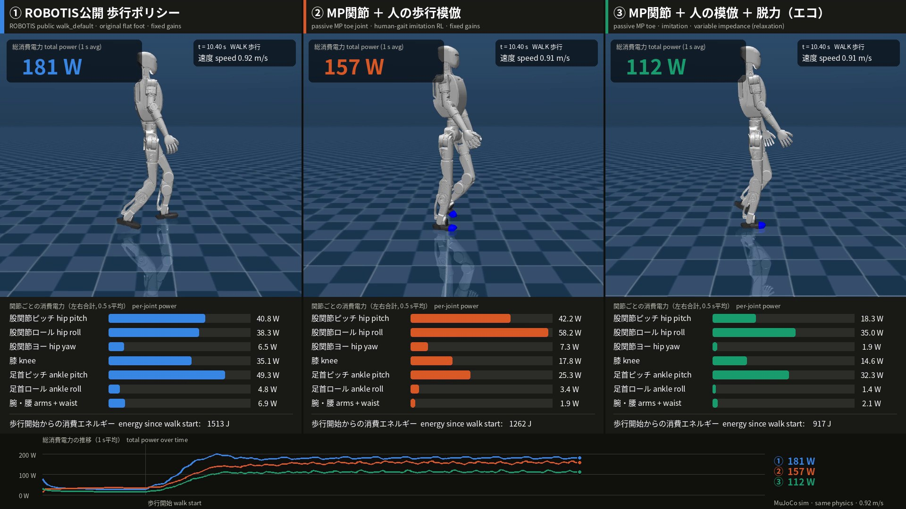

# K1 MP Eco-Walk

**Passive spring toe (MP) joints × human-gait imitation × learned relaxation → energy-efficient humanoid walking (MuJoCo simulation)**

受動バネのMP関節（つま先関節） × 人の歩行の模倣 × 学習による脱力で、ヒューマノイドの省エネ歩行を実現する（MuJoCoシミュレーション）

Idea & project: **Takeyuki-K** · License: Apache-2.0 (see [NOTICE](NOTICE)) · Simulation only



> **Simulation only (MuJoCo).** Independent personal research, **not affiliated with or endorsed by ROBOTIS.**
> MuJoCoによるシミュレーションのみ（実機ではありません）。個人の独自研究であり、ROBOTIS社とは無関係で、同社の承認・推奨を受けたものではありません。

---

## Idea / アイディア

Instead of making a humanoid walk with stiff, always-on motors, let **natural physics** do part of the work:

1. **Passive MP (toe) joint** – a motor-less torsion spring that bends when the body weight rolls onto the toes and returns the toe flat in swing. The spring is sized so that it can never lift the foot by itself.
2. **Imitation of human walking data** – only the hip→ankle vector is imitated (scaled by the leg-length ratio), the rest is solved by IK, so the robot learns a human heel-strike → foot-flat → toe-off rollover.
3. **Learned relaxation (脱力)** – the policy chooses joint stiffness Kp and damping Kd every 20 ms (the K1 motors' "MIT mode"), and is rewarded for low electrical power. It learned by itself to relax the hip and knee at push-off / swing (pendulum-like swing, passive knee flexion) and to stiffen the ankle for push-off.

モーターで固く制御し続けるのではなく、自然の力（つま先の受動バネ・人の歩き方・脚の振り子運動）を使って歩かせる、というアイディアです。

## Result / 結果

Three controllers on the same K1 model family, same MuJoCo physics (dt 2 ms, 50 Hz control), same start, straight walking at the same speed (~0.92 m/s), same electrical power model.
同一物理条件・同一速度・同一電力モデルで3つの制御を比較:

| | controller | speed | avg. electrical power | CoT (electrical) | vs ① |
|---|---|---|---|---|---|
| ① | ROBOTIS public `walk_default` policy, original flat foot | 0.92 m/s | 182 W | 0.57 | – |
| ② | MP joint + human-gait imitation, fixed gains | 0.90 m/s | 158 W | 0.50 | −13 % |
| ③ | **MP joint + imitation + learned relaxation** | 0.91 m/s | **114 W** | **0.36** | **−37 %** |

Videos / 動画: [`media/K1_3way_energy_comparison.mp4`](media/K1_3way_energy_comparison.mp4) (3-up comparison with live per-joint power),
[`media/K1_MP_heel_toe_walk.mp4`](media/K1_MP_heel_toe_walk.mp4) (②, heel-to-toe close-up),
[`media/K1_MP_eco_walk.mp4`](media/K1_MP_eco_walk.mp4) (③, live stiffness bars).

Other findings (simulation):
- ③ keeps the heel-strike → flat → toe-off sequence (17/18 heel-first touchdowns); MP bends up to ~55° at push-off.
- Robustness improved with relaxation: standing with random pushes 73 % → 88 % survival, stand→walk→stop with domain randomisation + pushes 86 % → 98 % (② vs ③, 64 envs, 8 s).
- The ranking ① > ② > ③ also holds for positive mechanical work (independent of the assumed motor constant): 53 W > 49 W > 44 W.

### Honest limitations / 注意点
- **① is a general-purpose policy** (omnidirectional velocity tracking, made for the real robot). ②③ are specialised for straight walking at one speed. The −37 % is valid for this condition only.
- ②③ have no heading control yet (lateral drift 0.8–1.8 m over 10 m).
- The electrical model uses an **assumed** motor constant Km (4.0 / 2.2 Nm/√W); gearbox friction, driver losses and electronics are not modelled. Compare the numbers relatively, not with other robots.
- No real-robot experiment yet. MP spring, toe mass and contact parameters are estimates.

## Power model / 消費電力の計算
At every 2 ms physics step for every joint: `τ = clip(Kp(q* − q) − Kd·q̇, motor limit)`

`P = Σ τ²/Km² + Σ max(τ·q̇, 0)` — copper (Joule) loss + positive mechanical work, no regeneration.
CoT = P / (m g v). The Joule + mechanical decomposition follows the common practice in legged-robot energetics (e.g. Seok et al., MIT Cheetah, IEEE/ASME T-Mech 2015).

## Repository layout
| path | content |
|---|---|
| `ai_sapiens/ai_sapiens_description/` | K1 model (ROBOTIS, Apache-2.0) + **K1 with MP joints** (`k1_mp.xml`, `k1_mp.urdf`, split foot meshes) |
| `k1_mp/` | MP joint generator, human-gait retargeting, imitation (stage 1) + RL (stage 2), policy `runs/final/model.pt`, ONNX in `deploy/` |
| `k1_mp_eco/` | variable-impedance env & PPO, eco policy `runs/eco1/model.pt`, energy analysis, ONNX + gain law in `deploy_eco/` (see [README_ECO.md](k1_mp_eco/README_ECO.md)) |
| `k1_compare/` | 3-way comparison: recording, power evaluation, figures, video composition; results in `results/` |
| `media/` | videos and key figure |

## Reproduce / 再現
```bash
pip install -r requirements.txt          # CPU is enough (2 cores were used)
export MUJOCO_GL=osmesa                   # or egl, for headless rendering
./scripts/fetch_external.sh               # gait data (CC BY 4.0) + ROBOTIS upstream (for ①)

cd k1_mp
python3 gen_model.py && python3 retarget.py && python3 test_mp.py   # model, reference, spring test
python3 ppo.py --stage 1 --iters 1100 --out runs/s1                     # imitation   (~1 h)
python3 ppo.py --stage 2 --iters 2500 --init runs/s1/model.pt --lr 1e-4 --out runs/s2   # RL (~1 h)

cd ../k1_mp_eco
python3 test_eco_equiv.py                                                # eco env == fixed env when gains = 1
python3 ppo_eco.py --stage 2 --iters 2500 --init runs/final/model.pt --from_fixed --lr 1e-4 --out runs/eco1

cd ../k1_compare
python3 record3.py robotis && python3 record3.py mp_fixed && python3 record3.py eco
for k in robotis mp_fixed eco; do python3 render_raw.py $k; done
python3 compose3.py                                                      # -> K1_3way_energy_comparison.mp4
```
The ROBOTIS `walk_default` policy is **not redistributed**; it is loaded from the upstream clone in `external/`.
Its observation (390 = 78 × 5 history) and action pipeline were reproduced from the upstream C++ sim2real code; it tracks 0.5/0.7/0.9 m/s commands at 0.494/0.703/0.901 m/s in our setup.

## Use this idea / このアイディアの利用について
You are free to use, modify and build on this work (Apache-2.0).
**If this work or its idea inspired yours, please credit `Takeyuki-K` and link this repository** (GitHub "Cite this repository" uses [CITATION.cff](CITATION.cff)).
自由に使ってください。参考にした場合は、ユーザー名 **Takeyuki-K** とこのリポジトリへのリンクの記載をお願いします。
Redistributions must keep the [NOTICE](NOTICE) file (Apache-2.0 §4(d)).

## Credits / クレジット
- **Robot model**: ROBOTIS AI Sapiens K1, [ROBOTIS-GIT/ai_sapiens](https://github.com/ROBOTIS-GIT/ai_sapiens) (Apache-2.0) — modified (passive spring MP toe joints added), see [ai_sapiens/NOTICE_MODIFICATIONS.md](ai_sapiens/NOTICE_MODIFICATIONS.md).
- **Human gait data**: M. Duarte, "Notes on Scientific Computing for Biomechanics and Motor Control" (BMC), [duartexyz/BMC](https://github.com/duartexyz/BMC), [CC BY 4.0](https://creativecommons.org/licenses/by/4.0/) — retargeted to the robot (`ref_gait.npz` stays under CC BY 4.0).
- **Software used** (not redistributed): MuJoCo (Apache-2.0), PyTorch (BSD-style/Apache-2.0), NumPy/SciPy/NetworkX/Shapely (BSD), trimesh/Rtree/PyYAML/ONNX Runtime (MIT), ONNX/OpenCV (Apache-2.0), imageio (BSD-2), matplotlib (PSF-based), Pillow (MIT-CMU), Noto Sans CJK font (SIL OFL 1.1), FFmpeg (used as an encoding tool only).
- Concept, design decisions and evaluation policy: Takeyuki-K. Implementation assisted by Claude (Anthropic).

"ROBOTIS" and "AI Sapiens" may be trademarks of their respective owner; they are used here only to identify the robot model.
