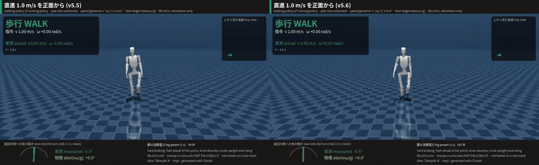

# K1 MP Eco-Walk

> **開発履歴。** v5.6.3 を `main` にした時点（2026-10-08）までの開発記録（v1 → v5.6.3）です。現在のポリシーはトップの [README](../README.ja.md) にあります。

[English](README.md) | **日本語**

[](https://doi.org/10.5281/zenodo.23178357)

**受動バネのMP関節（つま先関節） × 人の歩行の模倣 × 学習による脱力で、ヒューマノイドの省エネ歩行を実現する（MuJoCoシミュレーション）**

アイディア・方針決め: **Takeyuki-K** · 実装: Takeyuki-K の指示のもと Claude（Anthropic）で生成 · シミュレーションのみ

> **ライセンス:** コードと独自アセットは **Apache-2.0**、人の歩行データ由来の参照軌道は **CC BY 4.0**
> （Marcos Duarte & Renato Naville Watanabe, BMC）、CMUモーションキャプチャは自由利用（謝辞は下記）。
> リポジトリ全体が単一ライセンスではありません。[NOTICE](../NOTICE) と [THIRD_PARTY_LICENSES.md](../THIRD_PARTY_LICENSES.md) を参照してください。


> **MuJoCoによるシミュレーションのみ（実機ではありません）。** 個人の独自研究であり、**ROBOTIS社とは無関係で、同社の承認・推奨を受けたものではありません。**

**v5:** 歩行⇄走行の自動切替、立位からの走り出し、最高4.9 m/sの前足着地走行。モーター駆動トルクは、仮定したK1のトルク–速度包絡線の内側に保っています（着地衝撃で関節が速度上限を超えて回されることはあります）。
[走行に至るまで](#走行に至るまでv3--v4--v5) と [v5](#歩行走行の切替モーター駆動包絡線内の前足着地走行v5) を参照（シミュレーションのみ、実機未検証）。

**v5.6〜v5.6.3（ブランチ `v5.6-level-walk`・`v5.6.1`・`v5.6.2`・`v5.6.3`、確認中）:** 歩行時の左右の揺れを人並みに抑制（骨盤ロールの振れ幅 12° → 約7°）、遊脚の足上げを高く、腕振りをポリシーが制御。v5.6.1 では**素早く停止**（v5.5 と同等の速さ）し、**1 秒後に足を初期の立ち位置へ戻す**（関節角の順運動学・逆運動学と足裏接触センサーで計算）。**その場旋回は人のモーションキャプチャの旋回リズムで、両足を交互に上げて踏み替える**ようにした（以前は片足を床の上で回していた）。押し外乱下のその場旋回 63〜75 % → 69〜88 %。代償として歩行の脚電力は v5.5 比 +10〜13 %、遅いその場旋回で最大 +40 W。v5.6.2 では**左右の鏡像対称性**（「左右を入れ替えた状況では、左右を入れ替えた動きをする」）を学習に入れ、腕振りが左右対称になり、1.0 m/s 歩行の電力が 151 → 139 W（v5.5 は 125 W）に下がった。ただし押し外乱下のその場旋回は v5.6.1 より弱い。v5.6.3 では**シミュレーターの静止摩擦を厳密化**（立っている足が滑らない）、走行ポリシーも左右対称化（旋回時の体の傾きは維持）、静止中に関節の硬さが0にならないよう下限を設定。歩行の電力は 0.6 / 1.0 / 1.4 m/s で 95 / 128 / 169 W。走行旋回の自動減速は v·|ω| ≤ 2.5 m/s²。
詳細は [k1_mp_gait56/REPORT_GAIT56.md](../k1_mp_gait56/REPORT_GAIT56.md)。シミュレーションのみ。



**v5.5:** 歩行中・**走行中**の旋回（ヨーレート指令 最大1 rad/s）、その場旋回、旋回時の自動減速（走行中 v·|ω| ≤ 3 m/s²）と旋回内側への体の傾け（実測の傾き ≈ atan(vω/g)）、急停止（4.5 m/s から停止まで 5.9 s / 8.7 m → 4.4 s / 6.2 m）。
詳細は [k1_mp_gait55/REPORT_GAIT55.md](../k1_mp_gait55/REPORT_GAIT55.md)。シミュレーションのみ。


動画: [`media/K1_v55_turn_run.mp4`](../media/K1_v55_turn_run.mp4)（通しコース） ·
[`media/K1_v55_brake.mp4`](../media/K1_v55_brake.mp4)（急停止、側面） ·
[`media/K1_v55_inplace.mp4`](../media/K1_v55_inplace.mp4)（その場旋回）

---

## アイディア

モーターで固く制御し続けるのではなく、**自然の力**に仕事の一部を任せて歩かせる、というアイディアです。

1. **受動MP（つま先）関節** – モーターのないねじりバネ。体重がつま先に乗ると曲がり、遊脚中につま先を平らに戻します。バネの強さは、それだけで足を持ち上げることがないように設定しています。
2. **人の歩行データの模倣** – 模倣するのは股関節→足首のベクトルだけ（脚長比でスケーリング）で、残りはIKで解きます。これにより、人と同じ「かかと着地 → 足裏全体 → つま先離地」の転がりを学習します。
3. **学習による脱力** – ポリシーが20 msごとに関節の剛性Kpと減衰Kdを選び（K1モーターの「MITモード」）、消費電力が低いほど報酬が増えます。蹴り出し・遊脚で股関節と膝を脱力し（振り子のような遊脚、受動的な膝屈曲）、蹴り出しでは足首を固めることを自分で学習しました。

## 結果

同じK1モデル系統、同じMuJoCo物理（dt 2 ms、制御50 Hz）、同じスタート条件、直進歩行、**ほぼ同じ速度（0.90〜0.93 m/s）**、同じ電力モデルで3つの制御を比較しました。値は**シミュレーションによる推定値**で、[`k1_compare/results/comparison_table.csv`](../k1_compare/results/comparison_table.csv) から取っています。

| | 制御 | 速度 | 推定消費電力（全体） | うち脚 | CoT（電気） | ①比のCoT |
|---|---|---|---|---|---|---|
| ① | ROBOTIS公開の `walk_default` ポリシー、元の平らな足 | 0.901 m/s | 179.1 W | 172.4 W | 0.568 | – |
| ② | MP関節 ＋ 人の歩行の模倣、固定ゲイン | 0.927 m/s | 156.6 W | 154.5 W | 0.482 | −15 % |
| ③ | **MP関節 ＋ 模倣 ＋ 学習による脱力** | 0.917 m/s | **114.1 W** | **111.9 W** | **0.355** | **−37 %** |

つまり、**このシミュレーション条件では推定電気CoTが37 %低下**しました（全体の消費電力は −36 %）。
比較動画に描かれている値は、立った状態からのスタートを含む動画収録時のものなので、この定常状態の表とは異なります。

| ② かかと着地 → 足裏全体 → つま先離地、MP関節の受動的な曲がり（×0.25スロー） | ③ 1歩の中で学習された剛性（×0.25スロー） |
|---|---|
|  |  |

動画（MP4）: [`media/K1_3way_energy_comparison.mp4`](../media/K1_3way_energy_comparison.mp4)（関節ごとの消費電力を表示した3画面比較）、
[`media/K1_MP_heel_toe_walk.mp4`](../media/K1_MP_heel_toe_walk.mp4)（②、かかと〜つま先のクローズアップ）、
[`media/K1_MP_eco_walk.mp4`](../media/K1_MP_eco_walk.mp4)（③、剛性バー表示）。

その他の結果（シミュレーション）:
- ③ も かかと着地 → 足裏全体 → つま先離地 の順序を保っています（18回中17回がかかとから着地）。蹴り出しでMP関節は最大約55°曲がります。
- 脱力でロバスト性が向上しました: ランダムに押された状態での直立 73 % → 88 %、ドメインランダム化＋押しありの 立位→歩行→停止 86 % → 98 %（②と③、64環境、8秒; `k1_mp_eco/out/eco_results.json`）。
- 脚の正の機械仕事でも ① > ② > ③ の順は同じです（仮定したモーター定数に依存しない指標）: 53.0 W > 48.7 W > 44.2 W。

### 注意点
- **① は汎用ポリシー**です（全方向の速度追従、実機向け）。②③は1つの速度での直進歩行に特化しています。−37 % はこの条件に限った値です。
- ②③にはまだ進行方向の制御がありません（10 mで横方向に0.8〜1.8 mずれる）。
- 電力モデルは**仮定した**モーター定数 Km（4.0 / 2.2 Nm/√W）を使っています。ギアの摩擦、ドライバの損失、電子回路は含みません。他のロボットとの比較ではなく、相対比較として見てください。
- 実機実験はまだありません。MPバネ、つま先の質量、接触パラメータは推定値です。

## 速度指令への追従（v2）

1つのポリシーで、変化する前進速度指令 **0.30〜1.35 m/s** に追従します。MPのつま先、人の歩行の模倣、学習による脱力はそのままです。遅いほど小股・低ピッチ、速いほど大股・高ピッチになります（人のウォークレシオの法則）。詳細と全ての設計判断: [k1_mp_speed/REPORT_SPEED.md](../k1_mp_speed/REPORT_SPEED.md)。


| 指令 | 0.30 | 0.45 | 0.60 | 0.75 | 0.90 | 1.00 | 1.20 | 1.35 m/s |
|---|---|---|---|---|---|---|---|---|
| 実測速度 | 0.31 | 0.45 | 0.61 | 0.76 | 0.91 | 1.02 | 1.19 | 1.30 |
| 歩幅 (m) | 0.24 | 0.29 | 0.34 | 0.39 | 0.43 | 0.46 | 0.50 | 0.55 |
| 推定脚電力（ROBOTIS walk_default 比） | −8 % | −32 % | −33 % | −36 % | −37 % | −36 % | −36 % | −38 % |

転倒なし、全ての着地でかかとが接地、進行方向のずれ ≤ 4.3°、ランダム指令＋押し＋ドメインランダム化で生存率87.5 %。学習範囲を超えると約1.45 m/s（歩幅 ≈ 0.55 m）で頭打ちになりますが転倒はしません。それより速くするには走行が必要です（今後の課題）。動画: [`media/K1_speed_command_comparison.mp4`](../media/K1_speed_command_comparison.mp4)。

## 旋回・その場旋回・安全停止（v3）

速度指令の歩行に、**ヨーレート指令**を追加しました。歩行中の旋回、**その場旋回**、**安全停止**（先に減速してから両足を揃える）に対応します。詳細と全ての設計判断: [k1_mp_turn/REPORT_TURN.md](../k1_mp_turn/REPORT_TURN.md)。


| テスト（8台、立位から） | 結果 |
|---|---|
| 歩行旋回 0.6 m/s・±0.5 rad/s / 1.0 m/s・1.0 rad/s | 生存率100 %、ヨーレート誤差 ≤ 0.3 % |
| その場旋回 ±0.3 / ±0.6 / 0.8 rad/s | 生存率100 %、ずれ ≤ 2.8 cm/s |
| その場旋回 1.0 rad/s | 87.5 %（限界） |
| 1.2 m/s から / 歩行旋回から / その場旋回からの停止指令 | 8/8台が 3.3 / 2.3 / 1.7 秒後に直立 |
| 直進歩行 0.3〜1.35 m/s（回帰確認） | 転倒なし、速度誤差 ≤ 7.5 %、ただし **0.9〜1.35 m/s で v2 より消費電力 +16〜27 %** |

動画: [`media/K1_turning.mp4`](../media/K1_turning.mp4)。

## 走行に至るまで（v3 → v4 → v5）

走行は3段階で作りました。各段階で見つかった問題を次の段階で解決し、最終成果がv5です。
数値はすべて **MuJoCoシミュレーションによる推定値で、実機のK1では何も試験していません**。

| 段階 | 試したこと | わかったこと | 次につながったこと |
|---|---|---|---|
| **v3** ジョグ | CMUのジョグを模倣、かかと着地、電力より安定性を優先 | 1.54 m/sのジョグは342 W（CoT 0.64）。**ほぼ同じ速度なら歩行のほうがずっと省エネ**（v4の速歩き 1.63 m/s: 216 W、CoT 0.38、約40 %少ない） | 歩ける速度（約1.6 m/s）までは歩き、それ以上だけ走る |
| **v4** 速歩き＋高速走行 | 速歩き 1.35〜1.65 m/s（省エネ報酬あり）。走行は最高5.2 m/s、かかと着地のまま | 5.2 m/sは脚の関節を**K1 URDFの速度上限（11.5 rad/s）を超えて28 %の時間回した結果** → モーター仕様を超えている可能性。上限をペナルティにすると4.6 m/s | モーターのトルク–速度制限を物理的にモデル化する。かかと着地を見直す |
| **v5** 歩行⇄走行 | 前足〜中足着地、物理的なモーターモデル、立位→走行、歩行⇄走行の自動切替 | モーター駆動トルクを仮定した包絡線内に保ったまま4.9 m/s、かかと着地0 %、押しなしで切替成功率100 % | 現在の状態（v5の節を参照） |

**前足着地にした理由（アイディア: Takeyuki-K）** 速く走る人は前足〜中足で、体の真下に近い位置に着地します。体の前方でのかかと着地は、前向きの慣性にブレーキをかけやすいと考えられます。そこでv5は、v3/v4のかかと着地ではなく、CMUデータの人のランナーと同じ着地にしました。
注: この「ブレーキ効果」は動機となった仮説で、本プロジェクトでは**直接測定していません**（制動力積の解析なし）。また、市民ランナーの多くはかかとから着地しており、前足〜中足着地は速い速度域で典型的です。測定したのは結果で、モーター駆動トルクを仮定した包絡線内に保ったままの最高速度の向上と、同じ指令でのCoTが同等〜やや低いことです（下のv5の表）。

## 走行（ジョグ、v3）

**CMUモーションキャプチャ**（被験者16、"run/jog"）の走行を模倣し、指示どおり着地を**かかとから**に変更しました。電力より安定性と衝撃吸収を重視しています。詳細: [k1_mp_run/REPORT_RUN.md](../k1_mp_run/REPORT_RUN.md)。
**わかったこと:** この速度域では歩行のほうが走行より消費電力が少ない（1.54 m/sのジョグ 342 W・CoT 0.64 に対し、1.63 m/sの速歩き 216 W・CoT 0.38）。これがv4の速歩きとv5の歩行⇄走行切替につながりました。


| | 学習した走行 |
|---|---|
| 速度 / ピッチ | 1.54 m/s、174歩/分 |
| 空中期 | 時間の29 %（人の参照は35 %） |
| 着地 | かかとのみ、100 % |
| 足裏力のピーク | 体重の2.3倍（人の走行 ≈ 2.5倍） |
| 体幹 | 1.8°前傾、±0.36° |
| ロバスト性 | 押し（±0.6 m/s）＋摩擦・質量のランダム化で生存率100 %（24台、16秒） |
| 脱力 | 遊脚中のみ（Kp ≈ 公称の0.6）、着地前に再び固める |

動画: [`media/K1_running.mp4`](../media/K1_running.mp4)。
モーションキャプチャ: *The data used in this project was obtained from mocap.cs.cmu.edu. The database was created with funding from NSF EIA-0196217.*

## 速歩きと高速走行（v4）

**速歩き**（`k1_mp_fastwalk/`）: 1.35〜1.65 m/sは歩幅を伸ばした歩行でカバーします（省エネ報酬あり）。
**高速走行**（`k1_mp_sprint/`）: CMUの走行をスタイルの手本にし、速度カリキュラムで **5 m/s** まで。安定性と速度を優先し、電力は測定のみ。詳細: [REPORT_FASTWALK.md](../k1_mp_fastwalk/REPORT_FASTWALK.md)、[REPORT_SPRINT.md](../k1_mp_sprint/REPORT_SPRINT.md)。


| | 結果 |
|---|---|
| 速歩き 1.63 m/s | 216 W、CoT 0.38（1.54 m/sのジョグ 342 W → 歩行は約40 %少ない） |
| 高速走行の最高速度 | **5.21 m/s**、生存率100 %（24台、押し＋ランダム化でも） |
| 最高速度での走り方 | 239歩/分、歩幅1.31 m、空中期45 %、かかと着地99 %、体幹 +4.5° ± 1.0° |
| **モーター速度上限（URDF 11.5 rad/s）** | 5.2 m/sでは時間の28 %で超過。上限を守るポリシーは **4.6 m/s** |

**わかったこと:** 5.2 m/sは脚の関節をK1 URDFの速度上限を超えて動かした結果で、実機のモーターでは出せない可能性が高いです。v4ではモーターをモデル化しておらず（トルク–速度曲線なし）、着地もかかとのままでした。この2点がv5につながりました。

動画: [`media/K1_sprint.mp4`](../media/K1_sprint.mp4)。

## 歩行⇄走行の切替、モーター駆動包絡線内の前足着地走行（v5）

> **シミュレーションのみ・実機未検証です。** 下記のモーター制限は、K1 URDFの値と仮定したトルク–速度特性による*モデル*です。実機のK1で同じ走行ができるかは試験していません。

走行の着地は **前足から（着地の84〜99 %、残りは中足。かかと着地0 %）** になりました。脚のモーターは **K1 URDFのトルク–速度制限のモデル**（96.9 Nm、11.5 rad/s、逆起電力によるブレーキを含む仮定の曲線）に従います。ロボットは **立位から** 走り出せます。ゲートマネージャは、指令が1.8 m/sを超えると **歩行 → 走行** に（参照速度は1.6 → 2.0 m/sに跳ぶ）、減速すると **走行 → 歩行** に切り替えます。詳細: [REPORT_GAIT.md](../k1_mp_gait/REPORT_GAIT.md)。


| | 結果（MuJoCo） |
|---|---|
| 立位 → 歩行 0.3→1.65（+0.15 m/s） → 走行 → 5.5 指令 → 歩行 → 停止 | 100 %（8台）、ランダムな押しありで93.8 %（32台） |
| 立位 → いきなり3 m/sで走行 → 4.5 → 歩行 → 停止 | 100 %、押しありで93.8 % |
| モーター駆動トルクを仮定した包絡線内に保った最高走行速度 | **4.9 m/s**（v4のかかと着地・速度上限ペナルティでは4.6 m/s）— ただし関節は着地衝撃で速度上限を超えて回される（下表） |
| 走行中の着地 | 84〜99 %が前足から、残りは中足、**かかと着地0 %** |
| 切替速度付近 | 歩行 219 W（1.6 m/s、CoT 0.39）、走行 650 W（1.9 m/s、CoT 0.99） |

**エネルギー（推定、シミュレーション）** v5で歩行の消費電力がさらに下がったわけではありません（歩行ポリシーの電力はv4と同じ。本プロジェクトのエネルギー面の成果は、v1の推定電気CoT −37 %とv2の速度範囲の結果のままです）。走行ポリシーには**省エネ報酬がありません**。関節速度上限を守るv4のポリシー（かかと着地）と比べると、走行コストは3 m/sで同等、高い指令ではやや低く、v5のほうが速く走れます。

| 指令 | v4（かかと着地、速度上限はペナルティ） | v5（前足着地、モーターモデル） |
|---|---|---|
| 3.0 m/s | 2.93 m/s、CoT 0.93 | 2.97 m/s、CoT 0.95 |
| 4.0 m/s | 3.79 m/s、CoT 0.97 | 3.94 m/s、CoT 0.96 |
| 5.0 m/s | 4.43 m/s、CoT 1.04 | 4.67 m/s、CoT 1.03 |
| 5.5 m/s | 4.60 m/s、CoT 1.11 | 4.92 m/s、CoT 1.07 |

出典: `k1_mp_sprint/out/final_eval_motorlimit.json`（2 m/sで走り出し）と `k1_mp_gait/out/ew_rn6.json`（速歩きから走り出し）。開始条件が違うので、統制された比較ではありません。v5のエネルギー面の主な貢献は**切替ルール**です。ほぼ同じ速度なら走行は約3倍のコストがかかるので、約1.6 m/sまでは歩行を使います。

**モーター速度: モデルが保証すること・しないこと** モーターモデルが関節を速度上限を超えて*自ら駆動する*ことはありません。関節が上限を超えていたサンプルでは、モーターのトルクは常に動きに逆らうブレーキ側でした（駆動側0 %、`k1_mp_gait/out/joint_speed_audit.json`、`audit_joint_speed.py`）。ただし関節は、**着地衝撃と振り脚の慣性によって上限を超えて回されます**。

| 指令 | 速度 | いずれかの脚関節が上限を超えた時間 | 膝 p99 / ピーク | 足首ピッチ p99 / ピーク | 足首ロール（上限20.9） p99 / ピーク |
|---|---|---|---|---|---|
| 2.0 | 1.87 m/s | 0.0 % | 11.3 / 11.5 rad/s | 10.0 / 10.8 | 9.5 / 13.0 |
| 3.0 | 2.97 | 1.3 % | 11.4 / 11.7 | 11.7 / 12.1 | 15.9 / 22.1 |
| 4.0 | 3.94 | 6.2 % | 11.9 / 12.3 | 11.9 / 14.3 | 19.4 / 25.6 |
| 5.0 | 4.67 | 16.0 % | 12.4 / 12.9 | 12.2 / 17.5 | 20.1 / 33.9 |
| 5.5 | 4.92 | 19.1 % | 12.6 / 13.3 | 12.4 / 17.8 | 21.2 / 40.6 |

超過は通常わずか（中央値 0.4〜0.6 rad/s）ですが、最高速度では短いピークが上限の1.5倍（足首ピッチ）、1.9倍（足首ロール）に達します。実機のギア・モーター・ドライバがこの逆駆動（と回生エネルギー）に耐えられるかは**不明で、未検証**です。実機では3 m/s以下が仕様に最も近い範囲です。

動画: [`media/K1_walk_to_run.mp4`](../media/K1_walk_to_run.mp4)、[`media/K1_stand_to_run.mp4`](../media/K1_stand_to_run.mp4)。

## 消費電力の計算
2 msの物理ステップごと、関節ごとに: `τ = clip(Kp(q* − q) − Kd·q̇, motor limit)`

`P = Σ τ²/Km² + Σ max(τ·q̇, 0)` — 銅損（ジュール損失）＋正の機械仕事、回生なし。
CoT = P / (m g v)。ジュール損失＋機械仕事への分解は、脚ロボットのエネルギー評価で一般的な方法に従っています（例: Seok et al., MIT Cheetah, IEEE/ASME T-Mech 2015）。

## リポジトリ構成
| パス | 内容 |
|---|---|
| `ai_sapiens/ai_sapiens_description/` | K1モデル（ROBOTIS、Apache-2.0）＋ **MP関節付きK1**（`k1_mp.xml`、`k1_mp.urdf`、分割した足メッシュ） |
| `k1_mp/` | MP関節の生成、人の歩行のリターゲット、模倣（ステージ1）＋強化学習（ステージ2）、ポリシー `runs/final/model.pt`、ONNXは `deploy/` |
| `k1_mp_eco/` | 可変インピーダンス環境とPPO、省エネポリシー `runs/eco1/model.pt`、エネルギー解析、ONNX＋ゲイン則は `deploy_eco/`（[README_ECO.md](../k1_mp_eco/README_ECO.md) 参照） |
| `k1_mp_speed/` | **v2 速度指令**: 速度別の人の歩行ライブラリ、環境、PPO、評価、レポート、ポリシー `runs/final/model.pt`、ONNXは `deploy_speed/` |
| `k1_mp_turn/` | **v3 旋回**: ヨーレート指令、歩行旋回・その場旋回、安全停止。ポリシー `runs/final/model.pt`、レポート |
| `k1_mp_run/` | **v3 走行**: CMUモーションキャプチャ（BVH）のかかと着地リターゲット、アシストカリキュラム付き走行環境、ポリシー `runs/final/model.pt`、レポート |
| `k1_mp_fastwalk/` | **v4 速歩き** 1.65 m/sまで（歩行ライブラリは1.95 m/sまで）、ポリシー `runs/final/model.pt` |
| `k1_mp_sprint/` | **v4 高速走行**: CMU 09_04 の速度ライブラリ 1.6〜5.5 m/s、速度カリキュラム、ポリシー `runs/final/model.pt`（速度優先）と `model_motorlimit.pt` |
| `k1_mp_gait/` | **v5**: モーターのトルク–速度モデル付き前足着地走行、立位→走行、歩行⇄走行のゲートマネージャ（`gait.py`）、ポリシー `runs/final/walk.pt`、`runs/final/run.pt` |
| `k1_mp_gait55/` | **v5.5**: 歩行・走行中の旋回、その場旋回、自動減速、旋回内側への傾き、急停止。ゲートマネージャ `gait55.py`、ポリシー `runs/final/walk.pt`、`runs/final/run.pt`、レポート `REPORT_GAIT55.md` |
| `k1_mp_gait56/` | **v5.6**: 揺れの少ない歩行（倒立振子モデルに基づく参照 `make_ref56.py`、ロールの許容幅）、足上げ、腕の補正、停止前の足の置き直し。ゲートマネージャ `gait56.py`、レポート `REPORT_GAIT56.md` |
| `k1_compare/` | 3者比較: 収録、電力評価、図、動画合成。結果は `results/` |
| `media/` | 動画とGIF |
| `scripts/` | `fetch_external.sh`（固定した上流ソースの取得）、`smoke_test.sh` |
| `LICENSES/`、`NOTICE`、`THIRD_PARTY_LICENSES.md` | ライセンス文と帰属表示 |

## 再現

再現できる範囲と、その正確さ:

| | 状況 |
|---|---|
| **公開した全ポリシーの評価**（`*/runs/final/`、`k1_mp_eco/runs/eco1/` のチェックポイント） | 同梱のコードと固定した上流ソースで再現可能（A節）。例: 3者比較を再実行すると `k1_compare/results/comparison_table.csv` が1桁まで一致して再現されました |
| 生成したモデルファイルと参照モーション | 同梱スクリプトで**バイト単位で同一に**再生成（`scripts/smoke_test.sh` で確認、チェックサムは `scripts/generated_files.sha256`） |
| 固定MPと省エネポリシー（v1）、速歩き（v4）の学習 | 記載したコマンドは、実際に使ったときの公開コードのまま |
| 速度（v2）、旋回・ジョグ（v3）、高速走行（v4）、歩行⇄走行（v5）ポリシーの学習 | **反復的な研究プロセス**で作成しました。ステージの間でコード中の報酬・環境設定を変更しています。正確なコマンド、各ステージで引き継いだチェックポイント、コードの差分は各フォルダの `TRAINING_HISTORY.md` に記載しています。v2のステージ最終チェックポイントは同梱（`k1_mp_speed/runs/stages/`）、v3〜v5のものはGitHubのリリースアセット（`k1-mp-ecowalk_intermediate_checkpoints_*.zip`）で提供しています。今は存在しないコードで実行したステージは、同一には再実行できません。v2については公開コードだけで最初から学習し直し、同等の品質に達しました（転倒なし、速度誤差3.1 %以内、脚電力は公開ポリシーの −18〜0 %。`k1_mp_speed/REPORT_SPEED.md` §7） |

### 0. 環境
Ubuntu 24.04、Python 3.13.16、CPUのみ（GPU不使用）で試験しました。学習は1回あたり1〜2 CPUスレッドを使いました。以下の学習時間は目安で、ハードウェアに依存します。

```bash
# system packages: only needed for rendering videos and for the MP4/GIF post-processing (not for training)
sudo apt update && sudo apt install -y libosmesa6 libgl1 ffmpeg fonts-noto-cjk git
# Python packages (CPU build of PyTorch first; the default Linux wheel is the large CUDA build)
pip install torch==2.14.1 --index-url https://download.pytorch.org/whl/cpu
pip install -r requirements.txt
# pinned upstream sources: BMC gait data (commit 50a05ae) and ROBOTIS ai_sapiens (commit bdc40f1)
./scripts/fetch_external.sh
# end-to-end smoke test (~2 min): regenerate model + references (checksums), unit tests, 2-iteration trainings,
# 3 s rollout of every released checkpoint
./scripts/smoke_test.sh            # --full also regenerates the running references (~30 min)
```
代わりに `docker build -t k1-mp-ecowalk .` と `docker run --rm -it -v "$PWD":/work k1-mp-ecowalk scripts/smoke_test.sh` も使えます（Dockerfile: Python 3.13、OSMesa、FFmpeg、Noto Sans CJK、CPU版PyTorch）。同じスモークテストがGitHub Actions（`.github/workflows/smoke.yml`）でも動きます。スモークテストはネイティブ環境（Ubuntu 24.04）で確認しました。Dockerイメージ自体は私たちの環境ではビルドできなかった（イメージレジストリにアクセスできない）ので、Dockerfileの問題があれば報告してください。

注: `MUJOCO_GL=osmesa`（または `egl`）はレンダリング時だけ設定してください。動画スクリプトは自分で設定します。CUDA版のPyTorchでは、学習前に `MUJOCO_GL=osmesa` をexportするとPyTorchのimportがクラッシュしました。動画の字幕は Noto Sans CJK（`fonts-noto-cjk`、別のパスは `K1_FONT` / `K1_FONT_BOLD` で指定）を使い、ない場合はPillowの既定フォントになります。

### A. 公開済みポリシーの評価
| フォルダ | チェックポイント | コマンド | 保存される結果 |
|---|---|---|---|
| `k1_mp` | `runs/final/model.pt` | `python3 eval.py runs/final/model.pt --stand 1.5 --walk 8 --stop 2.5 --out out/k1_mp_walk.mp4`; `python3 robust.py runs/final/model.pt` | `results.json` |
| `k1_mp_eco` | `runs/eco1/model.pt` | `python3 eval_eco.py runs/final/model.pt runs/eco1/model.pt` | `out/eco_results.json` |
| `k1_compare` | ① ROBOTIS `walk_default`（`external/` から）、②、③ | `python3 compare3.py robotis && python3 compare3.py mp_fixed && python3 compare3.py eco && python3 plot3.py`（`k1_compare/` に書き込み） | `results/comparison_table.csv`、`results/res_*.json` |
| `k1_mp_speed` | `runs/final/model.pt` | `python3 eval_speed.py runs/final/model.pt`; ROBOTISの基準 `python3 robotis_sweep.py`; `python3 plot_speed.py` | `out/final_eval.json`、`out/final_sweep_dt002.json`、`out/speed_table.json` |
| `k1_mp_turn` | `runs/final/model.pt` | `python3 eval_turn.py runs/final/model.pt --json out/eval.json`; `python3 grid_turn.py runs/final/model.pt out/grid.json`; `python3 reg_v2.py` | `out/eval_final.json`、`out/grid_final.json`、`out/reg_v2.json` |
| `k1_mp_run` | `runs/final/model.pt` | `python3 eval_run.py runs/final/model.pt --json out/eval.json`（`--push --dr [--hard]`） | `out/eval_final.json`、`out/ev_*.json` |
| `k1_mp_fastwalk` | `runs/final/model.pt` | `python3 eval_fw.py runs/final/model.pt out/sweep.json`（基準は `--v2`） | `out/sweep_fw2.json`、`out/sweep_v2.json` |
| `k1_mp_sprint` | `runs/final/model.pt`、`model_motorlimit.pt` | `python3 eval_sprint.py runs/final/model.pt --speeds 3,4,5,5.5 --n 24`（`--push --dr`） | `out/final_eval*.json`、`out/ev_sp4_*.json` |
| `k1_mp_gait` | `runs/final/walk.pt`、`run.pt` | `python3 eval_gait.py runs/final/walk.pt runs/final/run.pt`; `python3 push_test.py runs/final/walk.pt runs/final/run.pt 8 out/push.json accel,standrun 11,12,13,14`; `python3 eval_run2.py runs/final/run.pt --entry walk --speeds 2,3,4,5,5.5 --n 16 --no_entry`; `python3 eval_walk2.py runs/final/walk.pt out/sweep.json` | `out/final_gait.json`、`out/final_push.json`、`out/ew_rn6.json`、`out/final_walk_sweep.json` |

ROBOTISの `walk_default` ポリシーは**再配布していません**。`external/ai_sapiens`（コミット `bdc40f1`）から読み込みます。観測（390 = 78 × 履歴5）と行動のパイプラインは上流のC++ sim2realコードから再現しました。私たちの環境では 0.5 / 0.7 / 0.9 m/s の指令に 0.494 / 0.703 / 0.901 m/s で追従します。

### B. 固定MPの学習（v1）
```bash
cd k1_mp
python3 gen_model.py && python3 retarget.py && python3 test_mp.py               # model, reference, spring test
python3 ppo.py --stage 1 --iters 1100 --out runs/s1                              # imitation (~1 h on 2 threads)
python3 ppo.py --stage 2 --iters 2500 --init runs/s1/model.pt --lr 1e-4 --out runs/s2   # RL (~1 h)
```

### C. 脱力の学習（v1）
```bash
cd k1_mp_eco
python3 test_eco_equiv.py                                                        # eco env == fixed env when gains = 1
python3 ppo_eco.py --stage 2 --iters 2500 --init ../k1_mp/runs/final/model.pt --from_fixed --lr 1e-4 --out runs/eco1
```

### D. 速度指令の学習（v2）
過去のステージA〜G（正確な順序、フラグ、引き継いだチェックポイント、各ステージの設定）:
[k1_mp_speed/TRAINING_HISTORY.md](../k1_mp_speed/TRAINING_HISTORY.md)。同梱のステージFのチェックポイントからのステージG（公開コードそのものを使った唯一のステージ）:
```bash
cd k1_mp_speed
python3 retarget_speed.py                                                        # speed library 0.30-1.65 m/s
python3 ppo_speed.py --iters 3500 --init runs/stages/stage_F.pt --add_heading_obs --lr 1e-4 --lr_min 5e-5 --out runs/speed7
```
公開コードだけで最初から（省エネポリシーから1ステージ、合計イテレーション数は同じ）:
```bash
python3 ppo_speed.py --iters 9300 --init ../k1_mp_eco/runs/eco1/model.pt --from_eco_full --lr 1e-4 --lr_min 5e-5 --out runs/repro_final_code
```

### E. 旋回、走行、速歩き、高速走行、歩行⇄走行（v3〜v5.6）
ステージごとの正確なコマンド、引き継いだチェックポイント、ステージ間のコードの変更:
[k1_mp_turn](../k1_mp_turn/TRAINING_HISTORY.md) · [k1_mp_run](../k1_mp_run/TRAINING_HISTORY.md) ·
[k1_mp_fastwalk](../k1_mp_fastwalk/TRAINING_HISTORY.md) · [k1_mp_sprint](../k1_mp_sprint/TRAINING_HISTORY.md) ·
[k1_mp_gait](../k1_mp_gait/TRAINING_HISTORY.md) · [k1_mp_gait55](../k1_mp_gait55/TRAINING_HISTORY.md)（v5.5） · [k1_mp_gait56](../k1_mp_gait56/TRAINING_HISTORY.md)（v5.6）。参照モーション: `retarget_speed.py`（旋回・速歩き）、
`retarget_run.py`（走行）、`retarget_sprint.py`（高速走行・ゲート）、切替用の状態バンク `make_walk_bank.py` / `make_run_bank.py`。

### F. 動画・図
`k1_compare`: `record3.py robotis|mp_fixed|eco` → `render_raw.py <k>` → `compose3.py`。`k1_mp_speed`:
`record_profile.py`、`video_profile.py render robotis|speed` → `video_profile.py compose`。v3〜v5.5: `video_turn.py`、
`video_run.py`、`video_sprint.py`、`video_gait.py`、`video_gait55.py`（使い方は各ファイルの先頭）。MP4/GIFの容量削減には
`ffmpeg -crf 24–26` と `palettegen stats_mode=full` + `paletteuse dither=none` を使いました。

## 役割分担

**アイディア・方針決め — Takeyuki-K**
- 構想: 受動バネのMP（つま先）関節 × 人の歩行の模倣 × アクチュエータの脱力による省エネなヒューマノイド
- 主な仕様: 体重が前に移ると曲がるが足を持ち上げることはないモーターなしのバネMP関節。かかと → 足裏全体 → つま先の接地順序。股関節→足首の動きだけを模倣して残りはIKで解く。立位→歩行の遷移は別の強化学習。遅い歩行は小股。走行は別の歩容として扱う。
  歩行中とその場の両方での旋回、停止指令での安全停止、旋回時の衝撃吸収に脱力を使う。走行: 人の模倣と安定性を優先、空中期からかかとで着地し、かかとを支点に上体を崩さず体を前に回す、電力は二の次（「省エネは結果」）。
  1.35〜1.6 m/sは歩幅を伸ばした速歩きと省エネ報酬で対応。高速走行は5 m/sを目標に安定性と速度を優先し、電力は結果として評価。走行は中足〜前足で着地（かかと着地は誤り）、sim2realのためにモーター速度上限を守る、立位→走行、しきい値を超えたら速度の跳びを許して歩行→走行に切替。
  v5.5: 走行中の旋回、大きな旋回指令では自動で直進速度を落とす、速いほど体全体を旋回内側に傾ける、急停止では着地脚の膝を曲げて慣性を吸収しつつ上体を真上〜やや足より後ろの上方向に伸ばす。
  v5.6: 歩行時は骨盤をなるべく水平に（人並みの揺れは許容）、遊脚の足上げを高く、腕振りでバランス、停止後は初期姿勢の位置へ足を運ぶ
- 評価基準: ほぼ同じ速度・条件での ROBOTIS 公開ポリシーとの比較。過去の結果を残せるようブランチを分けた段階的な開発。結果の選択・試験・統合

**実装 — Claude（Anthropic）で生成**
- コード、改変したロボットモデル（MJCF/URDF、分割メッシュ）、歩行のリターゲット、強化学習、評価ツール、動画、図、文書の生成と実装に、Takeyuki-K の指示・選択・試験・統合のもとで Claude（Anthropic）を広く使いました。これは作り方の説明であり、AI生成物の著作権の帰属についての主張ではありません（国によって異なります）。
- その方針のもとで Claude が行った設計判断は、理由とともに次に記録しています:
  [k1_mp_speed/REPORT_SPEED.md](../k1_mp_speed/REPORT_SPEED.md)（D1〜D12）、[k1_mp_turn/REPORT_TURN.md](../k1_mp_turn/REPORT_TURN.md)（T1〜T9）、
  [k1_mp_run/REPORT_RUN.md](../k1_mp_run/REPORT_RUN.md)（R1〜R12）、[k1_mp_fastwalk/REPORT_FASTWALK.md](../k1_mp_fastwalk/REPORT_FASTWALK.md)（F1〜F4）、
  [k1_mp_sprint/REPORT_SPRINT.md](../k1_mp_sprint/REPORT_SPRINT.md)（S1〜S12）、[k1_mp_gait/REPORT_GAIT.md](../k1_mp_gait/REPORT_GAIT.md)（G1〜G10）、
  [k1_mp_gait55/REPORT_GAIT55.md](../k1_mp_gait55/REPORT_GAIT55.md)（S1〜S12、v5.5）、[k1_mp_gait56/REPORT_GAIT56.md](../k1_mp_gait56/REPORT_GAIT56.md)（S1〜S12、v5.6）。

## このアイディアの利用について
自由に使い、改変し、発展させてください（コード: Apache-2.0。データファイルはそれぞれのライセンスに従います。[THIRD_PARTY_LICENSES.md](../THIRD_PARTY_LICENSES.md) を参照）。
**このプロジェクトやアイディアを参考にした場合は、ユーザー名 `Takeyuki-K` とこのリポジトリへのリンクの記載をお願いします**（GitHub の "Cite this repository" は [CITATION.cff](../CITATION.cff) を使います）。
Zenodoにアーカイブ済み: **DOI [10.5281/zenodo.23178357](https://doi.org/10.5281/zenodo.23178357)** — 引用の際はこのDOIをお使いください。

**特許で独占するつもりはありません。** 誰でも使い、問題を見つけ、改善できるように公開しています。役に立つなら、ヒューマノイドの標準的な要素の一つになってほしいと考えています。日付付きの公開（Zenodo DOI）は防衛的公開も兼ねています。
再配布の際は [NOTICE](../NOTICE) ファイルを残してください（Apache-2.0 §4(d)）。

## クレジット
- **ロボットモデル**: ROBOTIS AI Sapiens K1、[ROBOTIS-GIT/ai_sapiens](https://github.com/ROBOTIS-GIT/ai_sapiens)（Apache-2.0）、コミット `bdc40f1` — 改変あり（受動バネのMPつま先関節を追加）。[ai_sapiens/NOTICE_MODIFICATIONS.md](../ai_sapiens/NOTICE_MODIFICATIONS.md) を参照。
- **人の歩行データ**: Marcos Duarte and Renato Naville Watanabe, "Notes on Scientific Computing for Biomechanics and Motor Control" (BMC)、[BMClab/BMC](https://github.com/BMClab/BMC)、DOI [10.5281/zenodo.4599319](https://doi.org/10.5281/zenodo.4599319)、コミット `50a05ae`、[CC BY 4.0](https://creativecommons.org/licenses/by/4.0/) — ロボットにリターゲット。派生した参照ファイルは CC BY 4.0 のまま（一覧は [NOTICE](../NOTICE)）。
- **走行モーションデータ**: CMU Graphics Lab Motion Capture Database、[mocap.cs.cmu.edu](http://mocap.cs.cmu.edu)（被験者16 試行35、被験者9 試行4）、BVH変換 B. Hahne — 研究・商用ともに自由利用。*The data used in this project was obtained from mocap.cs.cmu.edu. The database was created with funding from NSF EIA-0196217.*
- **使用ソフトウェア**（再配布なし）: [THIRD_PARTY_LICENSES.md](../THIRD_PARTY_LICENSES.md) を参照。
- アイディア・方針決め・統合: Takeyuki-K。実装は Claude（Anthropic）で生成 — [役割分担](#役割分担) を参照。

「ROBOTIS」と「AI Sapiens」はそれぞれの所有者の商標である可能性があり、ここではロボットモデルを示すためだけに使用しています。
